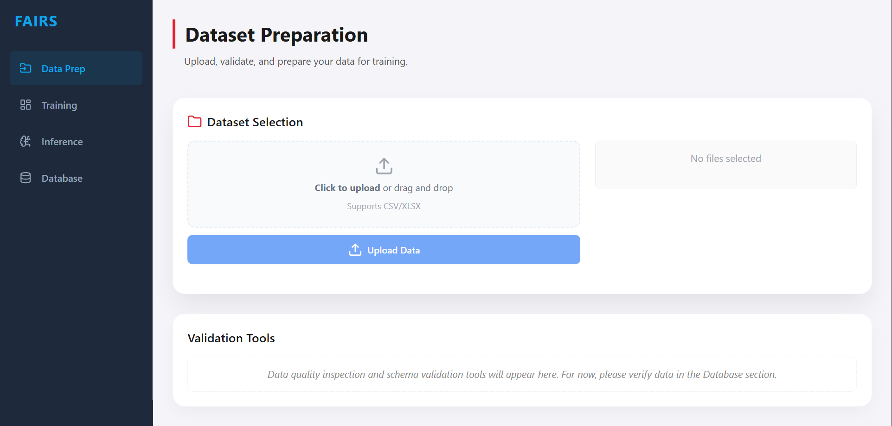
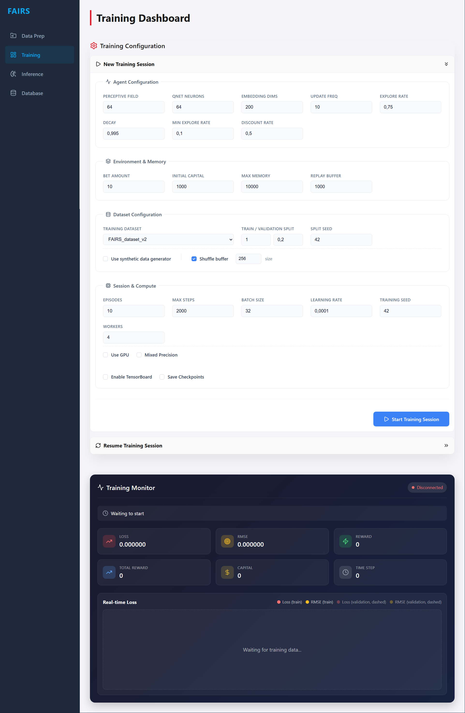

# FAIRS: Fabulous Automated Intelligent Roulette System

## 1. Project Overview
FAIRS is a research application for experimenting with roulette prediction using reinforcement learning. It provides a FastAPI backend for data ingestion, training, and inference, and a web UI for running sessions and reviewing results. The system stores datasets, checkpoints, and session outputs in an embedded SQLite database and uses a Windows launcher that installs portable runtimes and starts the backend and frontend together. This project is intended for educational and research use and does not guarantee predictive accuracy.

## 2. Model and Dataset (Optional)
FAIRS uses a Deep Q-Network (DQN) agent trained with reinforcement learning over sequences of recent roulette outcomes. The state representation is a fixed-length window of prior spins, and actions correspond to common roulette betting choices plus a no-bet option. Training and evaluation data come from user-provided CSV/XLSX uploads and optional synthetic sequences generated inside the app; no dataset is bundled with the repository.

## 3. Installation

### 3.1 Windows (One Click Setup)
Run `FAIRS/start_on_windows.bat` from the repository. The launcher automatically:
1. Downloads portable Python 3.14, uv, and Node.js into `FAIRS/resources/runtimes`.
2. Installs Python dependencies from `pyproject.toml`.
3. Installs frontend dependencies and builds the UI.
4. Starts the backend and frontend and opens the browser.

The first run downloads runtimes and builds the frontend. Subsequent runs reuse the cached runtimes and the existing frontend build when available. The installation is portable and stays inside the project folder without modifying global system settings.

### 3.2 macOS / Linux (Manual Setup)
Prerequisites:
- Python 3.14+ and `uv`
- Node.js 22.x (same major version used by the Windows launcher)

Installation steps:
1. Clone the repository.
2. (Optional) Copy `FAIRS/resources/templates/.env` to `FAIRS/settings/.env` and edit overrides.
3. Install backend dependencies:

```bash
uv sync
```

4. Start the backend:

```bash
uv run python -m uvicorn FAIRS.server.app:app --host 127.0.0.1 --port 8000
```

5. Build and start the frontend:

```bash
cd FAIRS/client
npm install
npm run build
npm run preview -- --host 127.0.0.1 --port 7861 --strictPort
```

## 4. How to Use

### 4.1 Windows
- Launch the app by double-clicking `FAIRS/start_on_windows.bat`.
- The UI is available at `http://127.0.0.1:7861` and the backend API at `http://127.0.0.1:8000` by default. If you change host or port values in `.env`, use those instead.
- If antivirus quarantines the portable Python runtime, allowlist `FAIRS/resources/runtimes/python`.

### 4.2 macOS / Linux
Start the backend and frontend in separate terminals:

```bash
uv run python -m uvicorn FAIRS.server.app:app --host 127.0.0.1 --port 8000
```

```bash
cd FAIRS/client
npm run preview -- --host 127.0.0.1 --port 7861 --strictPort
```

The UI is available at `http://127.0.0.1:7861` and the backend API at `http://127.0.0.1:8000`. FastAPI documentation is usually available at `http://127.0.0.1:8000/docs` unless disabled.

### 4.3 Using the Application
Typical workflow:
- Load data by uploading CSV/XLSX roulette series in the Data Prep tab.
- Configure and run training, or resume from an existing checkpoint, in the Training tab.
- Run inference step-by-step with a selected checkpoint in the Inference tab.
- Review stored datasets, sessions, and checkpoints in the Database tab.

**Data Prep**: Upload CSV/XLSX datasets and confirm the stored dataset name for training.


**Training**: Configure a run, monitor loss/rewards, and resume from checkpoints.


**Inference**: Load a checkpoint and step through predictions for a roulette session.


**Database browser**: Browse stored tables and session metadata.


## 5. Setup and Maintenance
- `FAIRS/setup_and_maintenance.bat`: Menu for removing logs, uninstalling local runtimes/frontend artifacts, and initializing the database.
- `tests/run_tests.bat`: Runs end-to-end Playwright tests by starting the backend and frontend, executing pytest, and shutting down the servers (requires the Windows portable runtimes).

## 6. Resources
`FAIRS/resources` stores runtime data and supporting files used by the application:
- checkpoints: saved model checkpoints for resuming training or running inference.
- database: embedded SQLite database used for datasets, sessions, and results.
- logs: application log output.
- runtimes: portable Python, uv, and Node.js installed by the Windows launcher.
- templates: starter configuration files such as `.env`.

## 7. Configuration
Backend configuration is loaded from `FAIRS/settings/server_configurations.json`, and runtime environment variables are read from `FAIRS/settings/.env` (use `FAIRS/resources/templates/.env` as a starting point). The frontend uses the default Vite preview configuration and does not require a separate config file in this repository.

| Variable | Description |
|----------|-------------|
| FASTAPI_HOST | Backend bind host, loaded from `FAIRS/settings/.env`, default `127.0.0.1`. |
| FASTAPI_PORT | Backend port, loaded from `FAIRS/settings/.env`, default `8000`. |
| UI_HOST | Frontend host for the Windows launcher, loaded from `FAIRS/settings/.env` by `FAIRS/start_on_windows.bat`, default `127.0.0.1`. |
| UI_PORT | Frontend port for the Windows launcher, loaded from `FAIRS/settings/.env` by `FAIRS/start_on_windows.bat`, default `7861`. |
| RELOAD | Enables backend auto-reload in the Windows launcher, loaded from `FAIRS/settings/.env` by `FAIRS/start_on_windows.bat`, default `false`. |
| MPLBACKEND | Matplotlib backend for headless plotting, loaded from `FAIRS/settings/.env`, default `"Agg"`. |
| KERAS_BACKEND | Keras backend selection, loaded from `FAIRS/settings/.env`, default `torch`. |


## 8. License
This project is licensed under the MIT license. See `LICENSE` for details.
