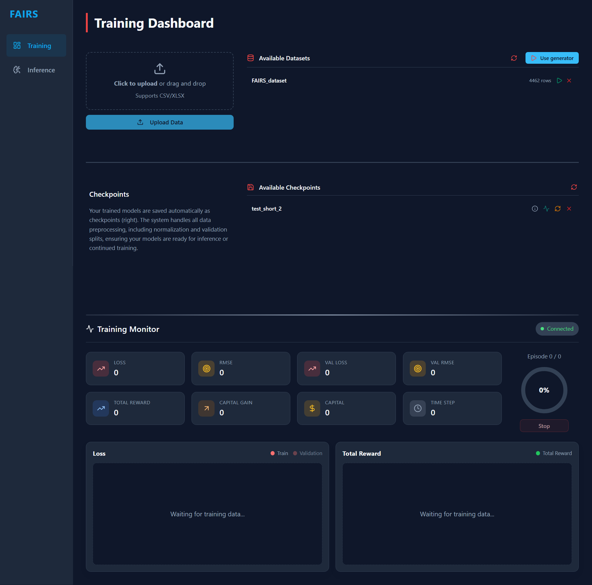
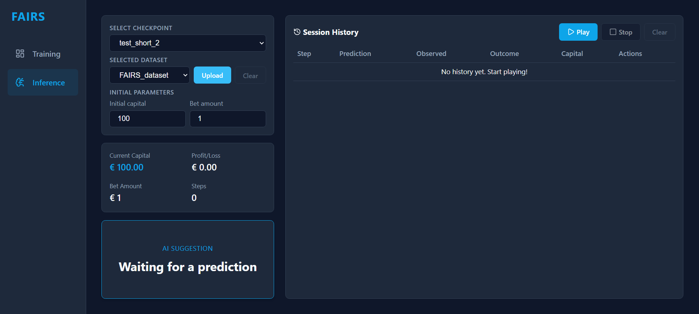

# FAIRS: Fabulous Automated Intelligent Roulette System

## 1. Project Overview
FAIRS is a research application for running roulette prediction experiments with a browser-based workflow. It combines a FastAPI backend and a React frontend: the backend handles data ingestion, training jobs, inference requests, and persistence, while the frontend provides screens for preparing datasets, running experiments, and reviewing results. Application data is stored locally in SQLite, and the Windows launcher starts the full stack with portable runtimes inside the project directory. The project is intended for educational and research use, and it does not claim guaranteed predictive performance.

> **Work in Progress**: This project is still under active development. It will be updated regularly, but you may encounter bugs, issues, or incomplete features.


## 2. Model and Dataset (Optional)
FAIRS uses a reinforcement learning approach based on a Deep Q-Network (DQN). The project trains an agent from roulette outcome sequences and applies the trained policy for inference during simulation sessions. Datasets are not bundled in the repository: training and evaluation data are user-provided (CSV/XLSX uploads), with optional synthetic series generated by the application.

## 3. Installation

### 3.1 Windows (One Click Setup)
Run `FAIRS/start_on_windows.bat`.

The launcher automatically:
1. Downloads portable Python, uv, and Node.js into `FAIRS/resources/runtimes`.
2. Installs backend dependencies from the project configuration.
3. Installs frontend dependencies and builds the UI.
4. Starts backend and frontend services and opens the app URL.

First run performs runtime download and frontend build. Later runs reuse existing local artifacts when available. Setup is portable and remains inside the repository folder.

### 3.2 macOS / Linux (Manual Setup)
Prerequisites:
- Python 3.14+
- `uv`
- Node.js 22.x

Installation steps:
1. Clone the repository.
2. Optionally copy `FAIRS/resources/templates/.env` to `FAIRS/settings/.env` and edit values.
3. Install backend dependencies:

```bash
uv sync
```

4. Start the backend:

```bash
uv run python -m uvicorn FAIRS.server.app:app --host 127.0.0.1 --port 8000
```

5. Start the frontend:

```bash
cd FAIRS/client
npm install
npm run build
npm run preview -- --host 127.0.0.1 --port 5173 --strictPort
```

## 4. How to Use

### 4.1 Windows
Launch `FAIRS/start_on_windows.bat`, then open the UI at `http://127.0.0.1:5173` (default). The backend API is exposed at `http://127.0.0.1:8000` (default).

### 4.2 macOS / Linux
Run backend and frontend in separate terminals:

```bash
uv run python -m uvicorn FAIRS.server.app:app --host 127.0.0.1 --port 8000
```

```bash
cd FAIRS/client
npm run preview -- --host 127.0.0.1 --port 5173 --strictPort
```

UI: `http://127.0.0.1:5173`  
API: `http://127.0.0.1:8000`  
API docs: `http://127.0.0.1:8000/docs`

### 4.3 Using the Application
Typical workflow:
- Configure training settings and start or resume a run in the Training page.
- Load a trained checkpoint and execute inference steps in the Inference page.
- Review available datasets directly from the Training and Inference workflows.

**Training page**: Open the Training tab, select your dataset and run parameters, then start a new training run or resume from a saved checkpoint. Use the dashboard and charts to follow progress and validate that metrics are updating as expected.



**Inference page**: Open the Inference tab, choose the checkpoint to use, and run predictions step by step for the active roulette sequence. Review each predicted action and outcome before moving to the next step.



## 5. Setup and Maintenance
- `FAIRS/setup_and_maintenance.bat`: `Remove logs` deletes `.log` files in `FAIRS/resources/logs`.
- `FAIRS/setup_and_maintenance.bat`: `Uninstall app` removes local runtimes, caches, `.venv`, frontend build artifacts, and dependency directories created by local setup.
- `FAIRS/setup_and_maintenance.bat`: `Initialize database` runs the database initialization script for local app state.
- `tests/run_tests.bat`: Starts backend and frontend, runs Playwright/pytest E2E tests, then stops the started services.

## 6. Resources
`FAIRS/resources` contains local runtime and application data:
- checkpoints: Stored model checkpoints used for resume and inference flows.
- database: Local SQLite data used by backend services.
- logs: Runtime log files written by application processes.
- runtimes: Portable Python, uv, and Node.js binaries used by Windows setup.
- templates: Starter files (including `.env`) used to create local configuration.

## 7. Configuration
Backend runtime settings are loaded from `FAIRS/settings/.env`, and backend application settings are read from `FAIRS/settings/configurations.json`. Frontend serving parameters are passed through launcher or command-line flags at startup.

## 8. License
This project is licensed under the MIT License. See `LICENSE` for the full terms.
