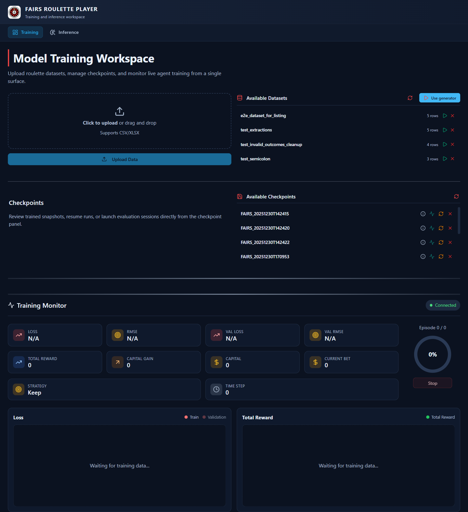
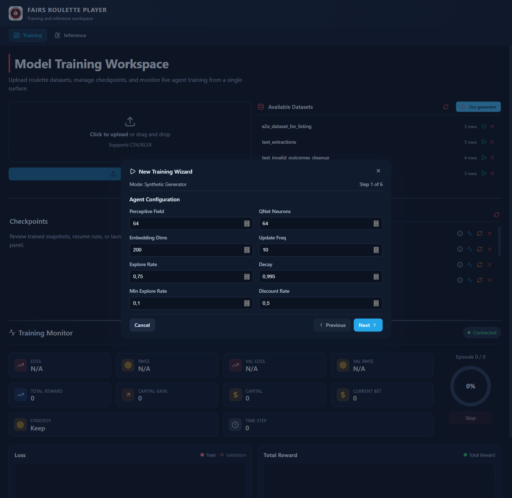
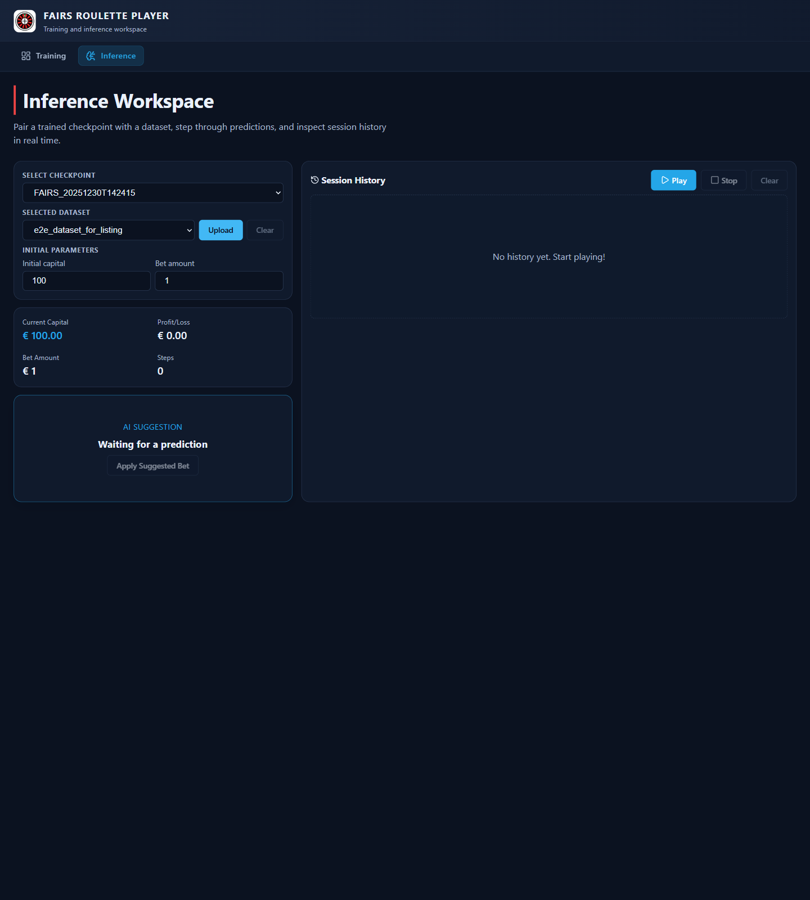

# FAIRS: Fabulous Automated Intelligent Roulette System
[](https://github.com/CTCycle/FAIRS-Roulette-Player/releases)
[](./pyproject.toml)
[](./FAIRS/start_on_windows.bat)
[](./LICENSE)
[](https://github.com/CTCycle/FAIRS-Roulette-Player/actions/workflows/ci.yml)

## 1. Project Overview
FAIRS is a research web application for roulette training and inference experiments. It includes:
- A FastAPI backend for dataset ingestion, training orchestration, checkpoint management, inference sessions, and persistence.
- A React + Vite frontend for training and inference workflows.
- An optional Tauri desktop shell for packaged Windows distribution.

> **Work in Progress**: This project is still under active development. You may encounter bugs, issues, or incomplete features.

## 2. Runtime Modes

### 2.1 Local Mode (Default)
Run from repository root:

```cmd
FAIRS\start_on_windows.bat
```

The launcher prepares local runtimes/dependencies and starts backend + frontend.

### 2.2 Desktop Mode (Tauri Packaging)
Prerequisites:
1. Rust installed with default toolchain configured (`rustup default stable`).
2. Local runtimes already prepared at least once:

```cmd
FAIRS\start_on_windows.bat
```

Build desktop artifacts:

```cmd
release\tauri\build_with_tauri.bat
```

Build output:
- `release/windows/installers`
- `release/windows/portable`

## 3. Configuration

Runtime profile files:
- Template: `FAIRS/settings/.env.example`
- Active profile: `FAIRS/settings/.env`
- Database settings: `FAIRS/settings/configurations.json`

Initialize `.env` once:

```cmd
copy /Y FAIRS\settings\.env.example FAIRS\settings\.env
```

Use `.env` to control host/port/runtime behavior and `configurations.json` for database mode/settings.

### 3.1 Database Initialization

Database backend selection is defined in `FAIRS/settings/configurations.json` (`database.embedded_database`).

- `SQLite` (`embedded_database=true`):
  - The application initializes the database automatically on startup only when `FAIRS/resources/database.db` is missing.
  - Initialization creates schema objects and seeds required data.
  - If `database.db` already exists, startup skips initialization.
- `PostgreSQL` (`embedded_database=false`):
  - The application does not initialize PostgreSQL automatically during startup.
  - Initialization is manual via:

```cmd
FAIRS\setup_and_maintenance.bat
```

Select `Initialize database` to run `FAIRS/scripts/initialize_database.py`.

`FAIRS/scripts/initialize_database.py` can also initialize SQLite when SQLite mode is selected, but this is normally unnecessary because SQLite initialization is already handled automatically by app startup.

## 4. Typical Workflow

1. Start the app: `FAIRS\start_on_windows.bat`
2. Open the UI and upload or generate dataset data.
3. Run training and manage checkpoints.
4. Start inference sessions using a selected checkpoint.
5. Optionally package a desktop build with Tauri when needed.

## 5. Testing

Run full automated tests:

```cmd
tests\run_tests.bat
```

Optional direct pytest commands:

```cmd
uv run pytest -q tests\unit
uv run pytest -q tests\e2e
```

## 6. Setup and Maintenance
Use:

```cmd
FAIRS\setup_and_maintenance.bat
```

Available maintenance actions include log cleanup, local uninstall/runtime cleanup, desktop build artifact cleanup, and database initialization.

## 7. Resources
- Application data and artifacts: `FAIRS/resources`
- Launcher-managed runtimes and environment: `runtimes`

## 8. User Documentation
Detailed operational guidance is available in:
- `assets/docs/USER_MANUAL.md`
- `assets/docs/PACKAGING_AND_RUNTIME_MODES.md`
- `assets/docs/ARCHITECTURE.md`

## 9. Screenshots
### Training Workspace
Overview of dataset upload, dataset selection, and checkpoint management:


Synthetic generator wizard (step configuration for training setup):


### Inference Workspace
Inference controls with checkpoint/dataset pairing and live session panel:


## 10. License
This project is licensed under the MIT License. See `LICENSE` for details.
