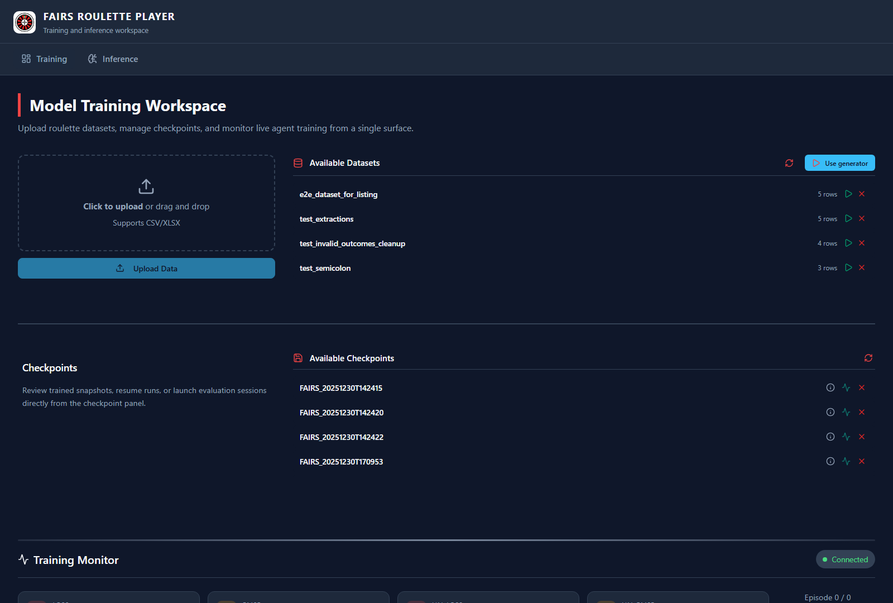
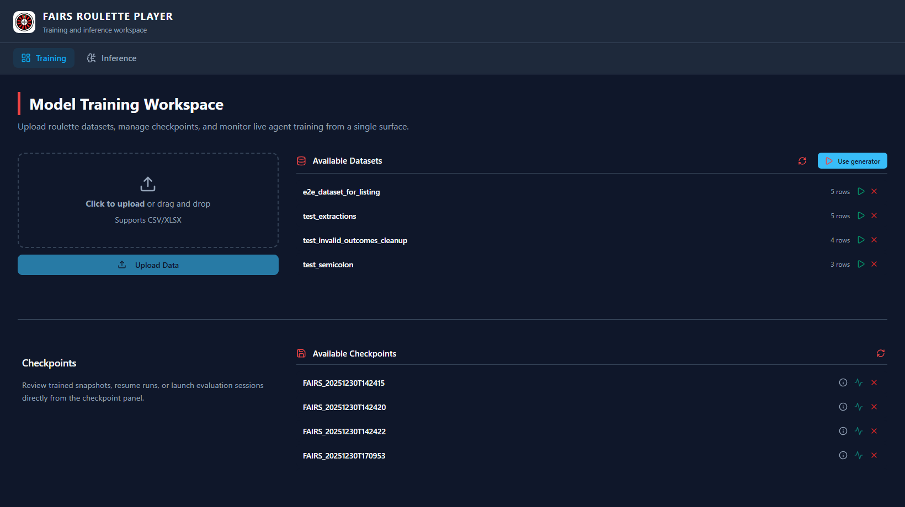
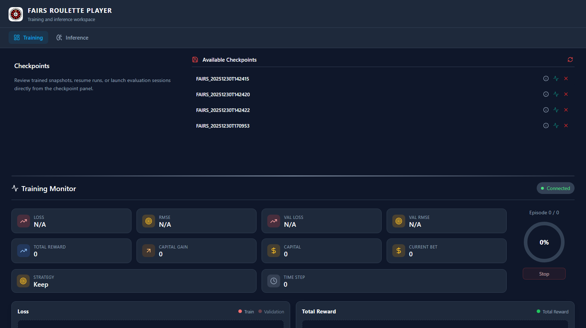
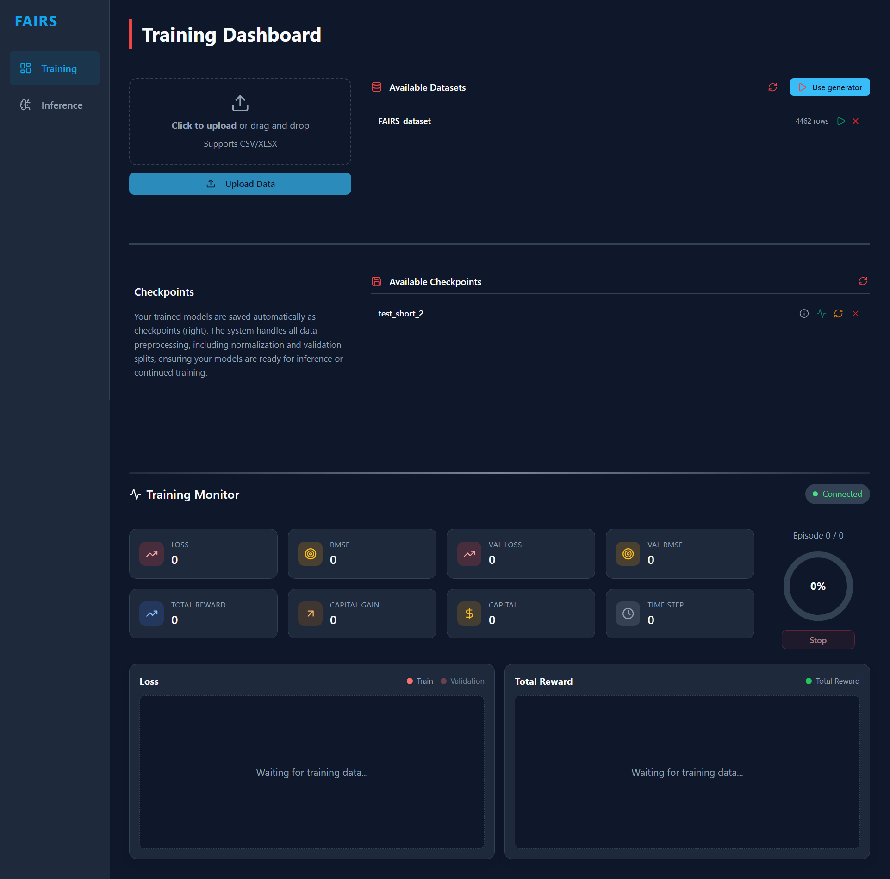
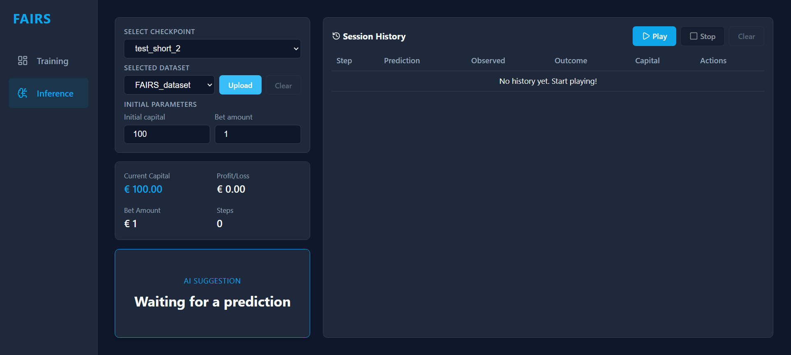

# FAIRS: Fabulous Automated Intelligent Roulette System

## 1. Project Overview
FAIRS is a research web application for roulette training and inference experiments. It combines:
- A FastAPI backend for dataset ingestion, training orchestration, checkpoint management, inference sessions, and persistence.
- A React + Vite frontend for training workflows, checkpoint management, and interactive inference sessions.
- An optional Tauri desktop shell for packaged Windows distribution.

The runtime model is multi-mode and configuration-first:
- Local mode is the default path (`FAIRS/start_on_windows.bat`), no Docker required.
- Cloud mode uses Docker (`docker-compose.yml`) for backend + frontend.
- Desktop mode uses Tauri, starts a local packaged backend, and serves the SPA through FastAPI.
- Mode switching is done by changing `FAIRS/settings/.env` values.

> **Work in Progress**: This project is still under active development. It will be updated regularly, but you may encounter bugs, issues, or incomplete features.

## 2. Model and Dataset (Optional)
FAIRS uses a Deep Q-Network (DQN) workflow for roulette sequence decision making. Training can use:
- User-provided CSV/XLSX datasets uploaded from the UI.
- Synthetic sequences generated by the app.

Inference sessions consume a trained checkpoint and a selected dataset, then evaluate predictions step by step with tracked capital and reward outcomes.

## 3. Runtime Modes

### 3.1 Local Mode (Default)
Run:

```cmd
FAIRS\start_on_windows.bat
```

The launcher automatically:
1. Downloads portable Python, `uv`, and Node.js into `FAIRS/resources/runtimes`.
2. Installs backend dependencies from `pyproject.toml`/`uv.lock`.
3. Installs frontend dependencies (uses `npm ci` when `package-lock.json` is present).
4. Builds the frontend and launches backend + frontend.

### 3.2 Cloud Mode (Docker)
1. Switch `.env` to cloud values.
2. Build and run:

```bash
docker compose --env-file FAIRS/settings/.env build --no-cache
docker compose --env-file FAIRS/settings/.env up -d
```

Stop containers:

```bash
docker compose --env-file FAIRS/settings/.env down
```

Cloud topology:
- `backend`: FastAPI (Uvicorn) on container port `8000`.
- `frontend`: Nginx serving SPA static files.
- Nginx proxies `/api/*` to `http://backend:8000/*`.

### 3.3 Desktop Mode (Tauri Packaging)
1. Activate desktop profile:

```cmd
copy /Y FAIRS\settings\.env.local.tauri.example FAIRS\settings\.env
```

2. Ensure portable runtimes exist:

```cmd
FAIRS\start_on_windows.bat
```

3. Regenerate desktop icon assets from the shared web favicon when needed:

```cmd
cd FAIRS\client
npm run tauri:icon
```

4. Build desktop artifacts through the repo packaging entrypoint:

```cmd
release\tauri\build_with_tauri.bat
```

Build output:
- `release/windows/installers`
- `release/windows/portable`

Runtime behavior:
- Tauri starts with `about:blank` and shows a startup screen immediately.
- Rust resolves the packaged workspace, reuses an existing `.venv` when available, otherwise runs `uv sync --frozen` into a controlled runtime root.
- The backend is started from the resolved `.venv`, then the window redirects to `http://127.0.0.1:<FASTAPI_PORT>/`.
- FastAPI serves the packaged SPA and exposes API routes under `/api`.

## 4. Mode Switching Procedure
Profiles:
- Local reference: `FAIRS/settings/.env.local.example`
- Cloud reference: `FAIRS/settings/.env.cloud.example`
- Desktop reference: `FAIRS/settings/.env.local.tauri.example`
- Active runtime file: `FAIRS/settings/.env`

Use one of the profiles as active `.env`:

```cmd
copy /Y FAIRS\settings\.env.local.example FAIRS\settings\.env
copy /Y FAIRS\settings\.env.cloud.example FAIRS\settings\.env
copy /Y FAIRS\settings\.env.local.tauri.example FAIRS\settings\.env
```

No application code changes are required to switch modes.

## 5. Configuration Contract
`FAIRS/settings/.env` defines runtime values for launcher/tests/docker/desktop.

### 5.1 Core Runtime
- `FASTAPI_HOST`
- `FASTAPI_PORT`
- `UI_HOST`
- `UI_PORT`
- `VITE_API_BASE_URL`
- `ENABLE_API_DOCS`
- `RELOAD`

### 5.2 Database Runtime
- `DB_EMBEDDED`
- `DB_ENGINE`
- `DB_HOST`
- `DB_PORT`
- `DB_NAME`
- `DB_USER`
- `DB_PASSWORD`
- `DB_SSL`
- `DB_SSL_CA`
- `DB_CONNECT_TIMEOUT`
- `DB_INSERT_BATCH_SIZE`

### 5.3 Other Runtime Variables
- `OPTIONAL_DEPENDENCIES`
- `MPLBACKEND`
- `KERAS_BACKEND`

Behavior:
- `FAIRS/settings/configurations.json` contains non-runtime defaults only.
- `DB_EMBEDDED` is read from env first, with JSON fallback for backward compatibility.
- When `DB_EMBEDDED=true`, embedded SQLite is used.
- When `DB_EMBEDDED=false`, external DB fields are read from env first.

## 6. Testing
Run automated tests:

```cmd
tests\run_tests.bat
```

The runner:
- Loads host/port from `FAIRS/settings/.env`.
- Exports `APP_TEST_FRONTEND_URL` and `APP_TEST_BACKEND_URL`.
- Uses resolved URLs for readiness checks and server startup.

## 7. Setup and Maintenance
`FAIRS/setup_and_maintenance.bat` options:
- Remove logs.
- Uninstall app (local runtime/dependency artifacts).
- Clean desktop build artifacts (`client/src-tauri/target/release` and `release/windows`).
- Initialize database (`FAIRS/scripts/initialize_database.py`).

## 8. Deterministic Build Notes
- Backend lockfile: `uv.lock`.
- Backend install path in Docker: `uv sync --frozen`.
- Frontend lockfile: `FAIRS/client/package-lock.json`.
- Frontend install path in Docker/desktop packaging: `npm ci`.
- Docker base images are pinned by tag in `docker/backend.Dockerfile` and `docker/frontend.Dockerfile`.

## 9. Resources
`FAIRS/resources` contains local runtime and data assets:
- `checkpoints`: trained model artifacts.
- `database`: embedded SQLite and related files.
- `logs`: runtime logs.
- `runtimes`: portable Python/uv/Node.js downloaded by the Windows launcher.

## 10. Screenshots
These documentation captures were generated from a local full-stack run with adaptive Playwright viewports.
Capture metadata (route, files, viewport, notes) is available in `assets/figures/manifest.json`.

### Landing (redirects to Training)


### Training Workspace
**Overview (upper section)**


**Overview (below the fold)**


**Training wizard detail**


### Inference Workspace


### Legacy Captures



## 11. Additional Documentation
- `assets/docs/PACKAGING_AND_RUNTIME_MODES.md`
- `assets/docs/ARCHITECTURE.md`
- `assets/docs/GUIDELINES_TESTS.md`

## 12. License
This project is licensed under the MIT License. See `LICENSE` for details.


