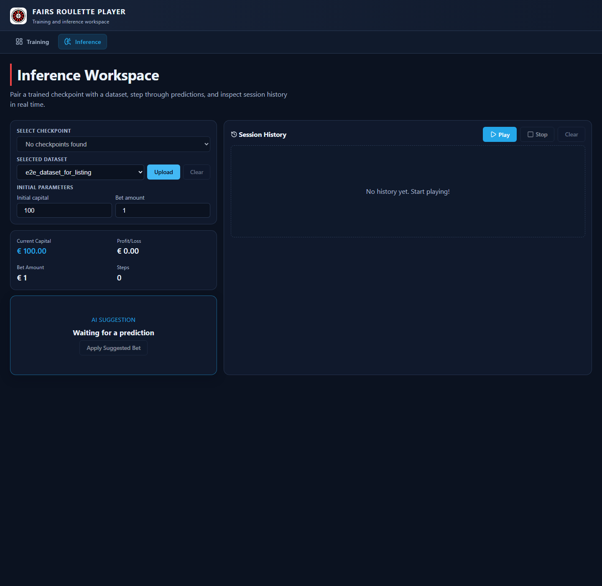

# FAIRS: Fabulous Automated Intelligent Roulette System
[](https://github.com/CTCycle/FAIRS-Roulette-Player/releases)
[](./app/server/pyproject.toml)
[](./start_on_windows.bat)
[](./LICENSE)
[](https://github.com/CTCycle/FAIRS-Roulette-Player/actions/workflows/ci.yml?query=branch%3Adevelop)

## 1. Project Overview
FAIRS is a research web application for roulette training and inference experiments. It includes:
- A FastAPI backend for dataset ingestion, training orchestration, checkpoint management, inference sessions, and persistence.
- A React + Vite frontend for training and inference workflows.
- An optional Tauri desktop shell for packaged Windows distribution.

## 2. Runtime Modes

### 2.1 Local Mode (Default)
Run from repository root:

```cmd
start_on_windows.bat
```

The launcher prepares local runtimes/dependencies and starts backend + frontend.

### 2.2 Desktop Mode (Tauri Packaging)
Prerequisites:
1. Rust installed with default toolchain configured (`rustup default stable`).
2. Local runtimes already prepared at least once:

```cmd
start_on_windows.bat
```

Build desktop artifacts:

```cmd
release\tauri\build_with_tauri.bat
```

Build output:
- `release/windows/installers`
- `release/windows/portable`

Versioned desktop source/configuration lives under `app/src-tauri` and should contain only Tauri source code, configuration, icons, capabilities, and required build metadata such as `Cargo.toml`, `Cargo.lock`, `build.rs`, and `tauri.conf.json`.

Generated desktop outputs under `app/src-tauri/target`, `app/src-tauri/bundle`, `app/src-tauri/gen`, and `release/windows` are not committed to Git. Windows `.exe` installers and portable binaries are published through release artifacts, not tracked in the repository.

## 3. Configuration

Runtime profile files:
- Template: `settings/.env.example`
- Active profile: `settings/.env`
- Non-database backend settings: `settings/configurations.json`

Initialize `.env` once:

```cmd
copy /Y settings\.env.example settings\.env
```

Use `.env` for runtime variables and all database settings; use `configurations.json` only for non-database backend settings such as job polling and device defaults. A `database` block in `configurations.json` is invalid and rejected at startup.

### 3.1 Database Initialization

Database backend selection is defined in `settings/.env` (`EMBEDDED_DATABASE`).

- `SQLite` (`EMBEDDED_DATABASE=true`):
  - The application initializes the database automatically on startup only when `app/resources/database.db` is missing.
  - Initialization creates schema objects and seeds required data.
  - If `database.db` already exists, startup skips initialization.
- `PostgreSQL` (`EMBEDDED_DATABASE=false`):
  - The application does not initialize PostgreSQL automatically during startup.
  - Initialization is manual via:

```cmd
setup_and_maintenance.bat
```

Select `Initialize database` to run `app/scripts/initialize_database.py`.

`app/scripts/initialize_database.py` can also initialize SQLite when SQLite mode is selected, but this is normally unnecessary because SQLite initialization is already handled automatically by app startup.

## 4. Typical Workflow

1. Start the app: `start_on_windows.bat`
2. Open the UI and upload or generate dataset data.
3. Run training and manage checkpoints.
4. Start inference sessions using a selected checkpoint.
5. Optionally package a desktop build with Tauri when needed.

## 5. Testing

Run full automated tests:

```cmd
app\tests\run_tests.bat
```

Optional direct pytest commands:

```cmd
uv run pytest -q app/tests/unit
uv run pytest -q app/tests/e2e
```

## 6. Setup and Maintenance
Use:

```cmd
setup_and_maintenance.bat
```

Available maintenance actions include log cleanup, local uninstall/runtime cleanup, desktop build artifact cleanup, and database initialization.
Desktop build cleanup removes generated output directories only; it does not delete `app/src-tauri` source/config files.

## 7. Resources
- Application data and artifacts: `app/resources`
- Launcher-managed runtimes and environment: `runtimes`

## 8. User Documentation
Detailed operational guidance is available in:
- `assets/docs/project_index.md`
- `assets/docs/operations/quick_start.md`
- `assets/docs/operations/workflows.md`
- `assets/docs/operations/troubleshooting.md`
- `assets/docs/runtime/startup.md`
- `assets/docs/runtime/deployment.md`
- `assets/docs/architecture/system_overview.md`

## 9. Screenshots & Demo

### Training Demo

DQN agent learning roulette over 30 episodes (epsilon-greedy exploration with decay):


### Training Workspace
Desktop view of dataset upload, dataset selection, checkpoint panels, and the live training monitor.


Mobile rendering of the same training workspace with the controls stacked for a narrow viewport.


### Inference Workspace
Inference controls for checkpoint and dataset pairing with session history.



## 10. License
This project is licensed under the MIT License. See `LICENSE` for details.
