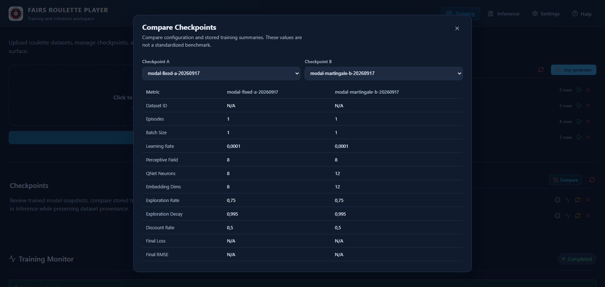
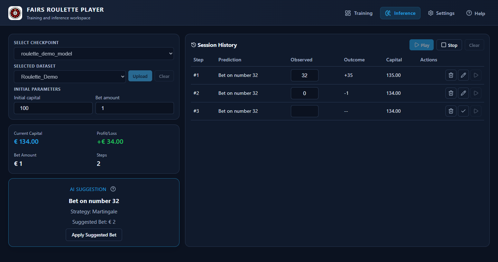
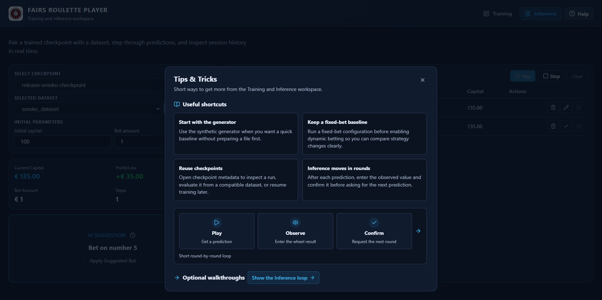

# FAIRS: Fabulous Automated Intelligent Roulette System
Last updated: 2026-08-31

     

FAIRS is a local, browser-based research workspace for exploring roulette training and inference experiments. It helps you prepare roulette data, train an agent, save reusable checkpoints, and run step-by-step sessions in which you can review suggestions against observed outcomes.

FAIRS is an experimental research tool. Its suggestions are not guaranteed predictions, gambling advice, or a substitute for independent judgment. Roulette outcomes remain uncertain, and a result that looks promising in a simulation may not generalize to new data or future play.

## What FAIRS is for

FAIRS brings the main parts of a controlled experiment into one workspace:

- Import roulette datasets from CSV or XLSX files and inspect them before use.
- Generate synthetic roulette data when you want a quick, repeatable starting point.
- Configure and start training through a guided six-section wizard.
- Watch live progress, rewards, simulated capital, and history charts while a run is active.
- Review checkpoints, resume interrupted training, and keep a trained model connected to its dataset.
- Pair a checkpoint with a dataset and step through an inference session one round at a time.
- Review predictions, observed values, bets, capital, results, and session history together.

The normal setup runs locally in your browser. The application is built with a Python/FastAPI service, a React/TypeScript/Vite web interface, and SQLite by default. PostgreSQL is available for users who need an external database.

## Before you begin

- Windows with PowerShell is the supported launch environment. The repository includes a portable Python runtime, uv, and Node.js setup, so a separate global Python or Node.js installation is not required.
- Use a fully extracted copy of the repository in a writable folder. Do not run the application from inside a ZIP archive or from a location where Windows prevents the launcher from creating files.
- The first setup needs outbound network access so the launcher can download runtimes and dependencies. Later starts reuse the prepared environment when it is ready.
- CPU operation is the normal path. Optional GPU, mixed-precision, and JIT choices are useful only when the local machine and installed machine-learning support them.
- FAIRS models a single-zero wheel: outcomes run from 0 through 36, with no additional 00. Use the dataset preview to check that uploaded data follows that range before starting a run.
- The interface is designed for a desktop browser window at least 1100 pixels wide. Phones and mobile layouts are not supported. A Windows tablet is suitable only when it provides a normal desktop browser experience.

macOS and Linux are not supported launch targets for this checkout. There is no supported installer, packaged executable, or container path; use the Windows launcher for the intended experience.

## Download the source

The current source release is v3.1.0. Download the version you want from the [GitHub Releases page](https://github.com/CTCycle/FAIRS-Roulette-Player/releases), extract it completely, and keep the extracted folder in a writable location.

## Install and launch on Windows

From the extracted repository root, open PowerShell and run:

~~~powershell
.\start_on_windows.ps1
~~~

On the first run:

1. Choose **4 — Install / update dependencies**.
2. Choose **Standard** for normal application use. Choose **Development** only when you need the optional test tools.
3. Choose **1 — Launch application**.

If the environment is missing, option 1 can prepare the Standard environment automatically. The first setup may take several minutes while runtimes and dependencies are downloaded. When the backend and web interface are ready, the launcher opens FAIRS in your default browser and prints the active addresses.

With the default settings, the [main interface](http://127.0.0.1:8051) is available at port 8051. If the browser does not open automatically, use the interface address printed by the launcher. The [backend health check](http://127.0.0.1:8890/api/health) is available for troubleshooting; the [API documentation](http://127.0.0.1:8890/docs) is intended for advanced users.

Later launches normally reuse the prepared environment. If a required runtime, dependency, or frontend build is missing, option 1 attempts to recover it before starting the application.

### Launcher menu

| Option | Use |
| --- | --- |
| 1 | Launch FAIRS and open the web interface. |
| 2 | Update the application from the main release line. This requires a clean checkout and does not switch branches or overwrite local edits. |
| 3 | Check whether the local checkout knows about newer application changes without downloading or applying them. |
| 4 | Prepare or update the local runtimes and dependencies. Choose **Standard** for normal use or **Development** for optional test tools. |
| 5 | Rebuild the web interface when the visible application needs refreshing after a source change. |
| 6 | Create or upgrade the selected database without resetting existing data. |
| 7 | Run the repository's automated checks. This is primarily for maintainers and contributors. |
| 8 | Remove application log files. |
| 9 | Clear local runtime and test caches. |
| 10 | Remove saved checkpoints only. |
| 11 | Remove the local database and logs while preserving saved checkpoints. An external PostgreSQL database is not deleted by this action. |
| 12 | Remove local runtimes, dependencies, and build output so the environment can be prepared again. Source files and user data are preserved. |
| 13 | Exit the launcher. |

Options 8 through 12 require the exact confirmation word DELETE. Read the description carefully before confirming a cleanup action.

## How a typical experiment works

FAIRS separates an experiment into two related phases:

1. **Prepare data.** Upload a CSV/XLSX file or use the synthetic generator. Inspect the preview and remove or correct data that does not represent the expected single-zero roulette range.
2. **Train an agent.** Use the Training workspace to choose the data and experiment settings, then start a run and watch its progress.
3. **Review a checkpoint.** A completed run produces a saved snapshot. You can inspect it, resume training, or use it in an inference session.
4. **Run inference.** Choose a checkpoint and compatible dataset, set the starting capital and bet amount, and move through the session round by round.
5. **Compare carefully.** Keep the dataset and important experiment choices consistent when comparing runs. A fixed-bet baseline is useful before testing a changing betting strategy.

## Training workflow

1. Open **Training**.
2. Upload a CSV/XLSX roulette dataset or start the synthetic generator.
3. Inspect the dataset preview before using it. Synthetic data is useful for a quick baseline and does not represent proof of a real-world advantage.
4. Open the training wizard and work through its six sections: **Agent Configuration**, **Environment & Memory**, **Bet Strategy Policy**, **Dataset Configuration**, **Session & Compute**, and **Summary**. Use the breadcrumbs to revisit a section and review the summary before starting.
5. Start training and monitor status, progress, loss/RMSE, reward, simulated capital, current bet, strategy, timestep, and history charts. Loss/RMSE is an error measure; reward and simulated capital show how the configuration performed in the experiment.
6. Open the checkpoint panel when the run completes, or use it to resume an interrupted run.

_The Training workspace combines dataset upload, checkpoint management, and a live training monitor with populated metrics and history charts._

Training data uses the same canonical 0..36 roulette range whether it comes from an uploaded file or the synthetic generator. The application also applies the same preparation rules to both sources so that comparisons are meaningful.

## How the learning works

FAIRS uses reinforcement learning, specifically a Deep Q-Network (DQN). In accessible terms, the agent repeatedly observes a recent window of roulette history together with its simulated capital, chooses an available action, and receives a reward from the simulated result. Over many rounds it learns estimates of which actions appear to produce better long-term rewards in the experiment.

Training balances two behaviors:

- **Exploration:** trying different actions so the agent can discover alternatives.
- **Exploitation:** using the action that currently has the best estimated value.

The agent also revisits earlier experiences in a randomized order and uses a slower reference for learning targets. These techniques make training less sensitive to the order of individual rounds; they do not make roulette outcomes predictable or change the underlying odds. A checkpoint is a reusable snapshot of what the agent learned and the context needed to continue the run.

### Understanding the experiment controls

The wizard exposes controls that affect how much history the agent sees, how much capacity the model has, how quickly it learns, how much experience it retains, how strongly it values future rewards, how much it explores, and how long it trains.

In practice:

- More history or a larger model can represent richer relationships, but increases time and memory use and may overfit.
- Larger learning steps can move faster but become unstable; smaller steps are steadier but slower.
- Larger batches and more retained experience can smooth learning, at the cost of memory and a slower warm-up.
- Greater emphasis on future rewards favors longer-term behavior; less emphasis favors immediate results.
- More exploration is normal early in training. Less exploration makes the later policy more deterministic, but can also hide alternatives.
- More episodes or steps give the agent more opportunities to learn and take longer to finish.

Change only one or two controls at a time, and keep the dataset, validation split, and random seed fixed when comparing runs. Lower loss or a favorable simulated capital curve is evidence about that particular experiment and dataset, not proof of a reliable roulette advantage.

## Inference sessions

1. Open **Inference**.
2. Select a trained checkpoint and compatible dataset, or upload an inference dataset.
3. Set the initial capital and bet amount, then start the session with **Play**.
4. Review the AI suggestion and decide whether to apply it for the experiment.
5. Enter the observed wheel value, confirm it, and then request the next prediction. Repeat this loop for each round.
6. Review the session history, including predictions, observed values, outcomes, bets, capital, and step results. Use **Stop**, **Clear**, and session shutdown controls as needed.

**Play** starts a session and fetches a prediction; it does not submit a wheel result for you. Applying a suggested bet changes the current bet amount only; it does not advance the session. The observed value must be recorded before the next prediction can use it as context.

_The Inference workspace pairs a trained checkpoint and dataset with live stepwise predictions, observed outcomes, and session history._

## Tips & Tricks

Open **Help** from the Training or Inference workspace for practical shortcuts and optional walkthroughs. Tips & Tricks covers the round-by-round inference loop, checkpoint reuse, synthetic-data setup, and fixed-bet baseline comparisons. The walkthroughs are optional and can be reopened whenever you need a refresher.

_Tips & Tricks brings workflow shortcuts and an optional Inference walkthrough into an active local inference workspace._

## Data, checkpoints, and storage

- FAIRS uses SQLite as the default local database. The launcher prepares or updates it automatically during setup and startup.
- PostgreSQL is supported for an advanced external setup. The database must be reachable and the account must have permission to create or update the selected database; use launcher option 6 when it needs to be prepared.
- Datasets, checkpoints, and logs are local application data in the normal setup. Keep a backup of any experiment you cannot recreate.
- Checkpoints and datasets form a training lineage. If a checkpoint still depends on a dataset, FAIRS may block dataset deletion to prevent an incomplete experiment.
- The application checks database compatibility before services start and does not silently reset or repair an incompatible database. If it reports a schema or database-state problem, follow the troubleshooting guidance before removing any data.

## Troubleshooting

### The launcher will not start

- Confirm that PowerShell is open in the extracted repository root and that you are using <code>.\start_on_windows.ps1</code>.
- If Windows reports that scripts are blocked, follow your organization's PowerShell policy or ask an administrator for the approved way to run the launcher. Avoid changing system-wide security settings just for FAIRS.
- If the first setup stops while downloading, restore network access and run option 4 with **Standard** selected.
- If the folder is read-only, move the extracted repository to a writable location and retry.

### The browser does not open or the page is blank

- Wait for the launcher to report that both services are ready, then open the printed interface address manually.
- Run option 4 with **Standard** selected to resync the application environment and rebuild the web interface.
- If the backend starts but the page still does not load, run option 5 to rebuild only the web interface.
- If a different application is using the configured ports, close that application and retry. The default interface port is 8051 and the default backend port is 8890.

### Database startup fails

- For the default local database, run option 6 and retry the launch.
- For PostgreSQL, confirm that the server is running, the connection details are correct, and the account has the required permissions.
- If FAIRS reports an incompatible, partially upgraded, or inconsistent database, do not delete or reset it. Preserve the data and ask the project maintainer to review the database state.

### Training is slow or stops unexpectedly

- CPU training is expected to take time, especially for longer experiments or larger models. Check the live status and charts before assuming the process is stuck.
- Start with the wizard defaults and a smaller experiment, then increase the training budget gradually.
- Use GPU or other acceleration choices only when the machine has compatible installed support.
- If the run was interrupted, open its checkpoint and use the resume action when available.

### A dataset is rejected or results look wrong

- Check the dataset preview before starting training or inference.
- Confirm that values represent single-zero roulette outcomes from 0 through 36 and that the file contains usable rows.
- Make sure the checkpoint and dataset belong to compatible experiments. Use the synthetic generator to verify the workflow before investigating a complex input file.

### Inference does not advance

After each prediction, enter and confirm the observed wheel value before requesting the next prediction. **Play** does not enter the observed result automatically, and applying a suggested bet does not advance the round.

### The layout is cut off

Enlarge the browser window to at least 1100 pixels wide. FAIRS keeps its desktop layout below that width rather than switching to a phone layout.

## Optional validation

The launcher includes **7 — Run test suite** for maintainers and contributors. Choose **Development** in option 4 first when the optional test tools are not installed. Normal users do not need to run the test suite to use the application.

## More documentation

The focused guides provide additional operational context:

- [assets/docs/operations/quick_start.md](assets/docs/operations/quick_start.md) — the shortest launch path.
- [assets/docs/operations/workflows.md](assets/docs/operations/workflows.md) — training and inference sequences.
- [assets/docs/operations/troubleshooting.md](assets/docs/operations/troubleshooting.md) — additional recovery checks.
- [assets/docs/runtime/startup.md](assets/docs/runtime/startup.md) — launcher behavior and database startup.
- [assets/docs/runtime/configuration.md](assets/docs/runtime/configuration.md) — advanced local settings.

## License

FAIRS is licensed under the MIT License. See [LICENSE](LICENSE) for the terms.
