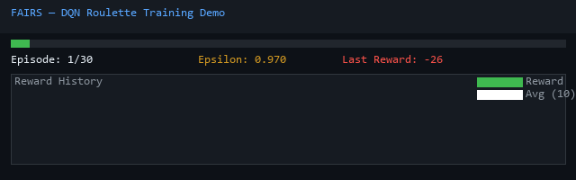
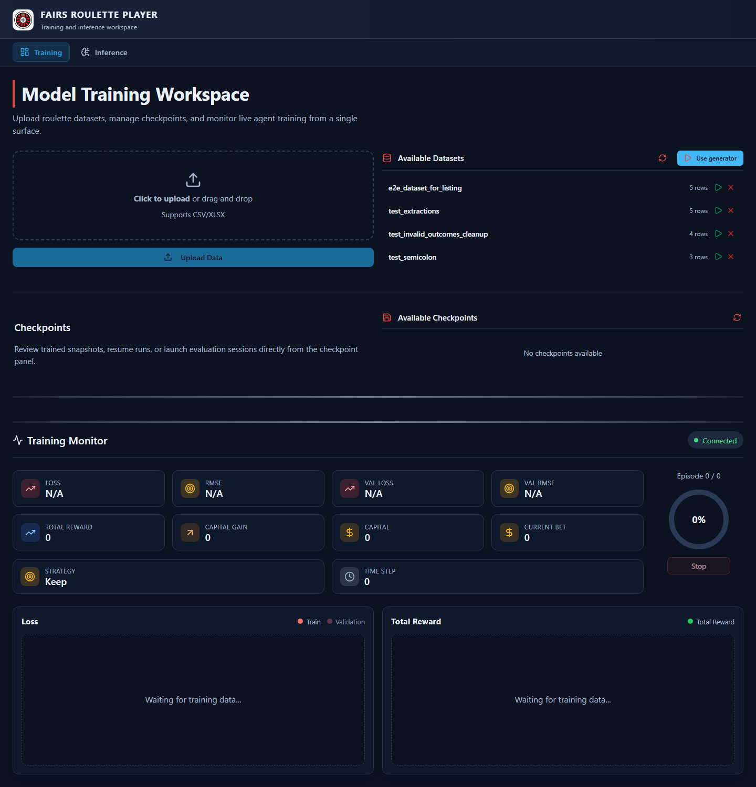
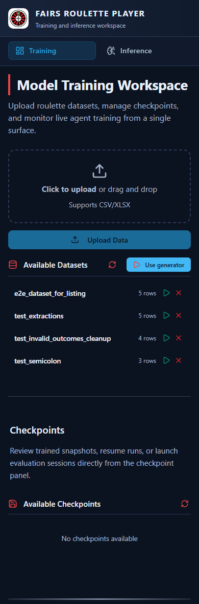

# FAIRS: Fabulous Automated Intelligent Roulette System
[](https://github.com/CTCycle/FAIRS-Roulette-Player/releases)
[](./app/server/pyproject.toml)
[](./start_on_windows.ps1)
[](./LICENSE)
[](https://github.com/CTCycle/FAIRS-Roulette-Player/actions/workflows/ci.yml?query=branch%3Adevelop)
[](https://ctcycle.github.io/CTCycle/)

## 1. Project Overview
FAIRS is a research web application for roulette training and inference experiments. It includes:
- A FastAPI backend for dataset ingestion, training orchestration, checkpoint management, inference sessions, and persistence.
- A React + Vite frontend for training and inference workflows.

## 2. Download

The [GitHub Releases page](https://github.com/CTCycle/FAIRS-Roulette-Player/releases) provides the versioned repository source ZIP for each release. This project is distributed as source for local web-mode execution; it does not provide a desktop installer or Windows executable.

## 3. Runtime Modes

### 3.1 Local Mode (Default)
Run from repository root:

```cmd
start_on_windows.ps1
```

The interactive launcher prepares local dependencies, builds the frontend, and starts FastAPI plus the Vite preview server. Select option 2 to install or update dependencies without launching.

## 4. Configuration

Runtime profile files:
- Template: `settings/.env.example`
- Active profile: ignored local file `settings/.env` (created automatically from the template)
- Non-database backend settings: `settings/configurations.json`

Initialize `.env` manually if needed:

```cmd
if not exist settings\.env copy settings\.env.example settings\.env
```

Use `.env` for runtime variables and all database settings; use `configurations.json` only for non-database backend settings such as job polling and device defaults. A `database` block in `configurations.json` is invalid and rejected at startup.

### 4.1 Database Initialization

Database backend selection is defined in `settings/.env` (`EMBEDDED_DATABASE`).

- `SQLite` (`EMBEDDED_DATABASE=true`):
  - The application creates the configured database automatically only when the SQLite file is missing.
  - If `database.db` already exists, startup skips initialization and does not validate or alter the schema.
- `PostgreSQL` (`EMBEDDED_DATABASE=false`):
  - The application never creates or initializes PostgreSQL during normal startup.
  - Startup only checks that the configured database accepts a non-mutating connection.
  - Initialization is manual via:

```powershell
.\start_on_windows.ps1
```

Select option 3, `Initialize database`, to run `app/scripts/initialize_database.py`.

`app/scripts/initialize_database.py` also uses the safe missing-file rule for SQLite. It does not reset or reseed an existing SQLite database.

## 5. Typical Workflow

1. Start the app: `start_on_windows.ps1`
2. Open the UI and upload or generate dataset data.
3. Run training and manage checkpoints.
4. Start inference sessions using a selected checkpoint.

## 6. Testing

Run full automated tests:

```cmd
app\tests\run_tests.bat
```

Optional direct pytest commands:

```cmd
uv run pytest -q app/tests/unit
uv run pytest -q app/tests/e2e
```

## 7. Setup and Maintenance
Use:

```cmd
start_on_windows.ps1
```

The interactive menu supports launching, dependency installation, database initialization, tests, log cleanup, cache cleanup, and uninstalling local dependencies while preserving user data.

## 8. Resources
- Application data: `app/resources`; `FAIRS_USER_DATA_DIR` can override the mutable data root
- Launcher-managed runtimes and environment: `runtimes`

## 9. User Documentation
Detailed operational guidance is available in:
- `assets/docs/project_index.md`
- `assets/docs/operations/quick_start.md`
- `assets/docs/operations/workflows.md`
- `assets/docs/operations/troubleshooting.md`
- `assets/docs/runtime/startup.md`
- `assets/docs/runtime/deployment.md`
- `assets/docs/architecture/system_overview.md`

## 10. Screenshots & Demo

### Training Demo

DQN agent learning roulette over 30 episodes (epsilon-greedy exploration with decay):



### Training Workspace
Desktop view of dataset upload, dataset selection, checkpoint panels, and the live training monitor.



Mobile rendering of the same training workspace with the controls stacked for a narrow viewport.



## 11. License
This project is licensed under the MIT License. See `LICENSE` for details.
