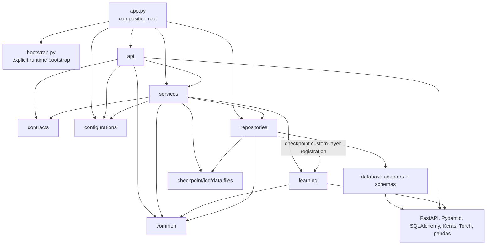
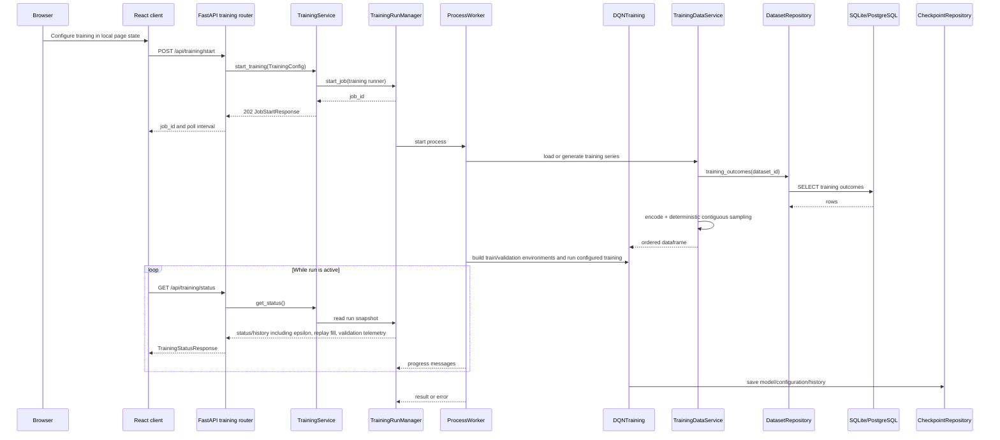
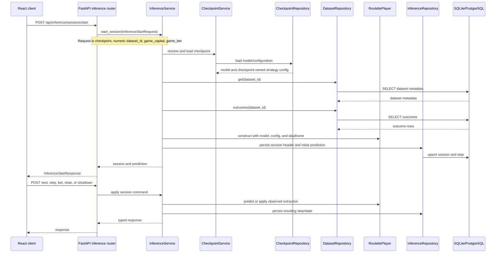
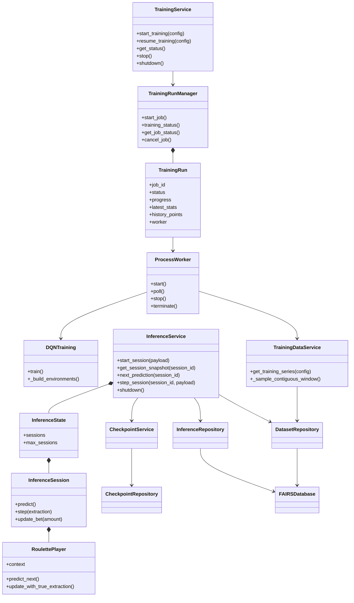

## Execution And Data Flow

Last updated: 2026-09-03

## Current Layering

FAIRS is a layered local monolith with an explicit composition root. The names below describe ownership, not a claim that every package is framework-independent.

- **Interface:** `app/server/api/*` validates HTTP input, calls an application service, validates the response, and translates selected exceptions to HTTP status codes.
- **Contracts:** `app/server/contracts/*` contains Pydantic request/response contracts and validated settings models shared between the interface and application code. `TrainingConfig` also enforces cross-field DQN invariants such as replay-memory capacity, epsilon bounds, and dynamic-betting relationships.
- **Application services:** `app/server/services/*` coordinates dataset import, checkpoint lifecycle, training runs, inference sessions, startup checks, and worker-process orchestration.
- **Learning execution:** `app/server/learning/*` contains roulette betting rules, neural models, training algorithms, and inference players. It receives prepared data and explicit runtime inputs from application services.
- **Persistence adapters:** `app/server/repositories/*` owns SQLAlchemy schema, engines, transactions, dataset/inference repositories, and checkpoint filesystem/configuration I/O.
- **Configuration:** `app/server/configurations/*` resolves JSON settings and typed environment database settings. `app/server/bootstrap.py` is invoked by the FastAPI lifespan before Keras-backed services are imported; import-time composition remains filesystem- and ML-safe.
- **Shared primitives:** `app/server/common/*` contains paths, constants, logging, normalization, error mapping, version lookup, and the shared roulette feature transformation.

## Current Module Dependency Diagram

The dashed repository-to-learning edge is limited to custom Keras-layer registration required when loading checkpoints. Learning execution does not construct databases or import application repositories.

## Startup Flow

`app/server/app.py` constructs the FastAPI object and routes before lifespan startup. The lifespan then:

1. Resolves typed server settings from JSON and the explicit environment database fields.
2. Runs startup validations and creates the canonical data-root, `logs`, and `checkpoints` directories.
3. Runs the shared Alembic create/upgrade runner for SQLite or PostgreSQL. Empty databases upgrade to `head`; non-empty unversioned databases, drift, unknown/ahead revisions, and multiple heads are rejected without runtime adoption or stamping.
4. Constructs `FAIRSDatabase`, the `DatasetRepository`, and the `InferenceRepository`. The application engine is disposed during lifespan cleanup.
5. Constructs one `CheckpointService`, one `TrainingRunManager`, `DatasetService`, `TrainingService`, and `InferenceService` with those concrete collaborators.
6. Stores the runtime objects on `application.state` for FastAPI dependency providers and marks the application ready only after all required resources are available.

The `server` package itself is import-safe. Constructing `server.app:app` mounts transport routes without loading Keras/Torch, creating runtime directories, reading mutable paths, or configuring application logging. The lifespan invokes `bootstrap_runtime()`, then imports the ML-backed repositories/services, initializes the database, and publishes `starting` to `ready`; its `finally` block transitions through `stopping` and releases resources in reverse order. Direct imports of common path/logger modules remain side-effect free.

If any startup step fails, already acquired resources are cleaned up before the failure is re-raised. Shutdown is idempotent and failure-isolated: inference sessions, training workers/queues, the manager, database pool, and application-owned logging handlers are each attempted independently.

## Training Flow

`TrainingRunManager` is the single in-process training-run state owner. It owns the authoritative `TrainingRun`, worker handle, progress, cancellation flag, latest statistics, and history projection. A run may use a child `ProcessWorker`, while the browser polls the status endpoint; there is no WebSocket or durable job table. A stop request enters `stopping` and becomes `cancelled` only after the worker has stopped. Terminal runs are bounded in memory. Checkpoint output is staged and published only after model, strategy, configuration, and history writes succeed. `additional_episodes` is a resume operation input and is not added to the persisted checkpoint configuration.

Stored-dataset `sample_size` is applied as a seeded contiguous window rather than `DataFrame.sample`, so the reduced dataset preserves chronological adjacency. The later validation split remains chronological. `seed` controls the selected data window. `training_seed` controls Keras initialization, the DQN action/replay RNG, and roulette-environment random starts.

`DQNTraining._build_environments()` is shared by initial and resumed training. It validates that the full dataset and each requested train/validation partition contain more observations than the perceptive field, then constructs both environments. Resume therefore produces fresh validation measurements when the checkpoint configuration has a validation split. Sparse validation history points retain `null` between real validation measurements rather than copying the last value forward.

Training status remains inside the existing `latest_stats` dictionary contract and now projects epsilon, experience count, replay-buffer size, and validation reward. The frontend uses those values to distinguish replay-buffer warm-up from epsilon-greedy exploration without introducing another job-state model.

## Inference Flow

The inference start contract does not accept dataset-source labels or strategy overrides. The optional `X-Preserve-Inference-Session` header is an internal replacement boundary used while the client replays a session. The checkpoint owns strategy behavior; the service only overlays the per-session capital and bet. Active sessions are held in `InferenceState` with a bounded in-memory session count and locked mutations. Database rows provide history and snapshots, not a rehydration mechanism for the live `RoulettePlayer` object. A missing live session after backend restart is a clean expiration.

`RoulettePlayer` still returns the existing `confidence` response field for API compatibility, but the value is a softmax normalization of unbounded DQN Q-scores and is not a calibrated success probability. The React boundary maps it to `relativePreference` for user-facing research UX. The Decision Inspector displays that preference together with recent confirmed observations and betting context. No separate inference analytics service or persistence model is introduced.

Checkpoint handoff from Training to Inference requires the dataset ID recorded by the checkpoint to still exist and satisfy the checkpoint perceptive field. The client no longer silently substitutes the first compatible dataset. Choosing a different dataset remains possible from Inference, but becomes an explicit experimental-context change.

## Important Class Relationships

## Responsibility And Duplication Notes

- Validation at the API boundary, service boundary, and database constraint boundary is intentional defense in depth; it is not automatically accidental duplication. Cross-field DQN constraints are mirrored in the training wizard for immediate UX feedback and remain authoritative in `TrainingConfig`.
- Roulette feature derivation is one shared transformation in `server.common.roulette`.
- `DatasetRepository` is the sole SQL authority for dataset metadata and outcome rows. `TrainingDataService` owns encoding and sequence-preserving sampling after repository reads.
- `CheckpointRepository` owns checkpoint filesystem I/O and validates the current checkpoint configuration contract. `CheckpointService` owns lifecycle policy, including dataset-reference checks before deletion.
- `TrainingRunManager` owns the one authoritative in-process training-run model; `TrainingService` coordinates operations and worker execution around it.
- Training and inference pages own their workflow snapshots. `useTrainingStatus` is the single frontend training-status polling hook; API parsers reject malformed or legacy shapes instead of silently selecting compatibility defaults.
- Checkpoint comparison is a frontend projection of existing checkpoint metadata, not a new experiment entity or persistence layer.

## Concurrency And Observability

- Most handlers are synchronous `def` handlers; upload reads are asynchronous at the transport boundary and blocking parse/import work runs through the threadpool. `UploadFile` is closed in the route's `finally` block.
- Training runs outside the request thread in a worker process monitored by the `TrainingRunManager` thread.
- Inference is synchronous and stateful per active backend process, with an application operation lock plus per-session locks.
- Logs are timestamped `FAIRS_*.log` files under the configured data-root `logs` directory.
- `GET /api/health` is a lightweight readiness check exposing application version from installed `fairs-server` package metadata; it has no desktop/runtime-mode field. The frontend treats health/status recovery as retryable with capped backoff, while mutating operations are not retried automatically.

## Related Files

- Read `backend_api.md` for the endpoint inventory and transport contract.
- Read `persistence.md` for relational tables and filesystem storage.
- Read `findings_and_remediation.md` for evidence, priorities, and migration steps.
