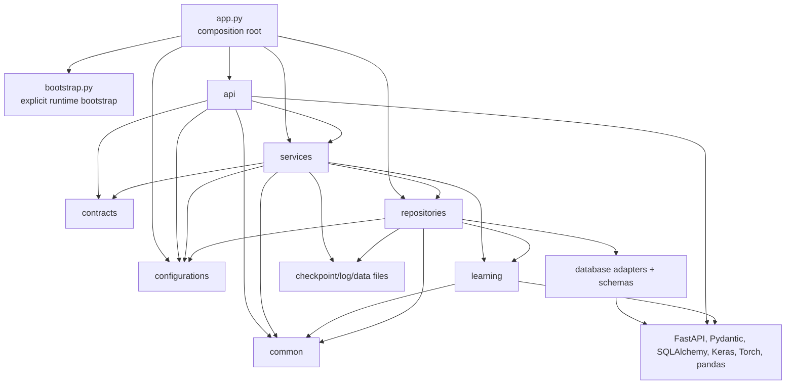
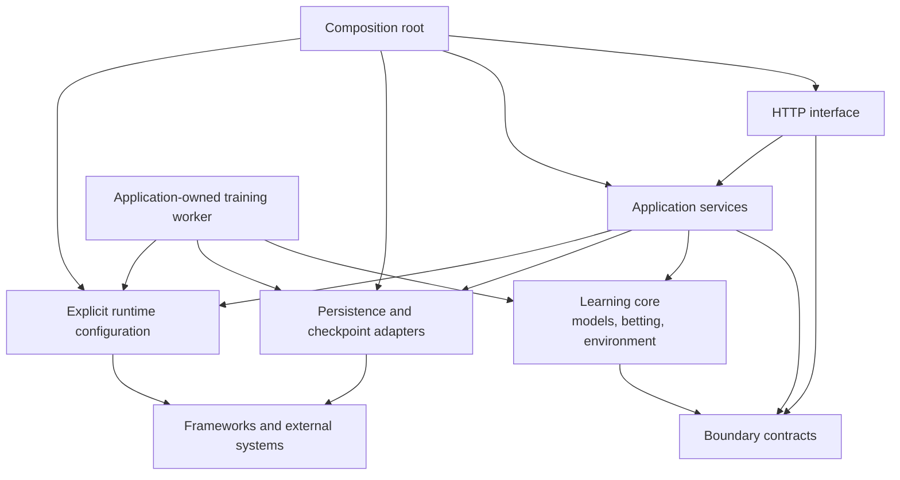
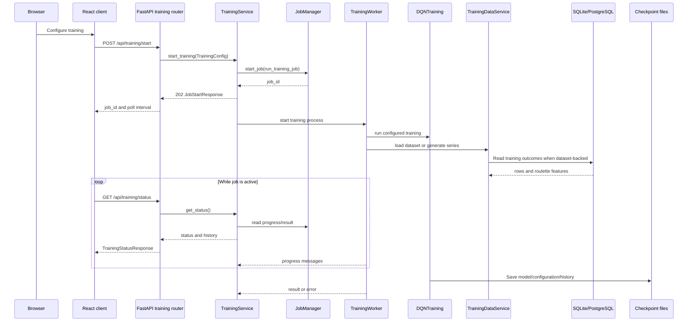
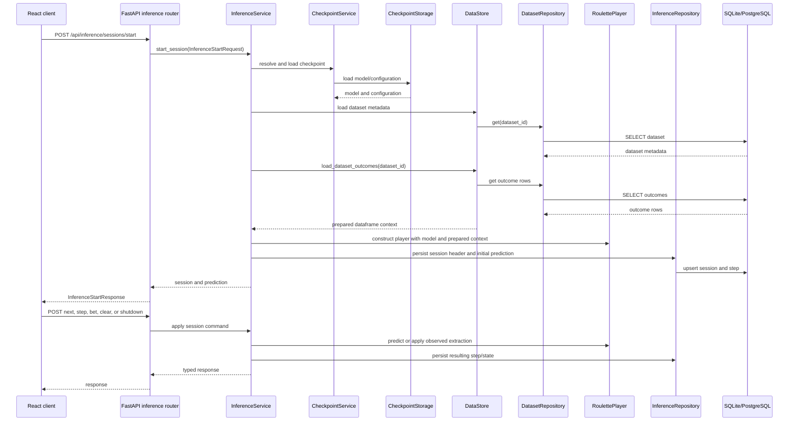
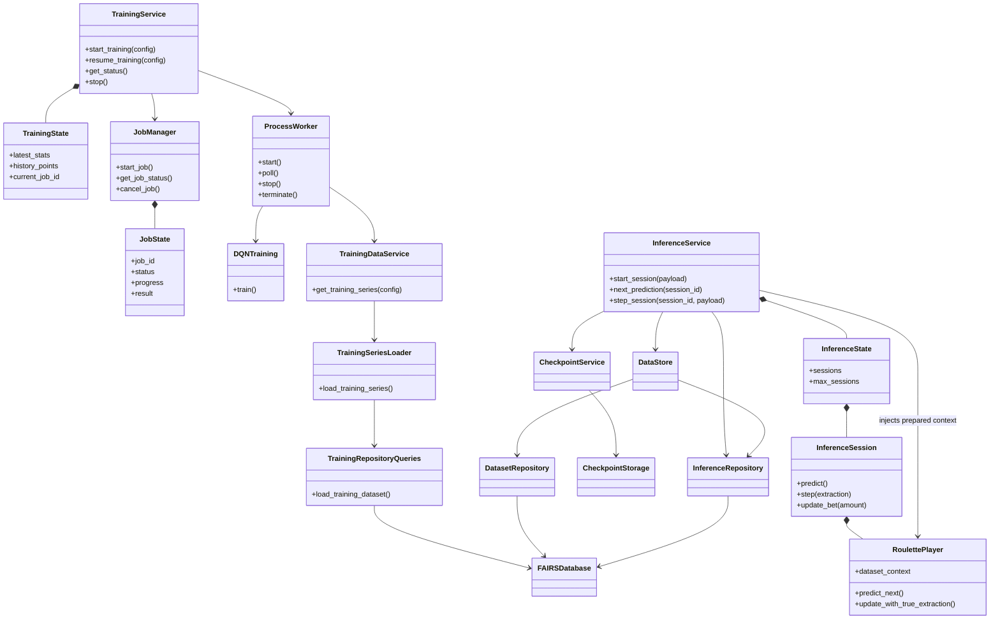

## Execution And Data Flow

Last updated: 2026-08-20

## Current Layering

The current application is a layered monolith with an explicit composition root. The names below describe ownership, not a claim that every package is framework-independent.

- **Interface:** `app/server/api/*` validates HTTP input, calls an application service, validates the response, and translates selected exceptions to HTTP status codes.
- **Contracts:** `app/server/contracts/*` contains Pydantic request/response contracts and validated settings dataclasses/models shared between interface and application code.
- **Application services:** `app/server/services/*` coordinates dataset import, checkpoints, training lifecycle, inference sessions, startup checks, and in-process job/session state.
- **Learning execution:** `app/server/learning/*` contains roulette betting rules, neural models, training algorithms, and inference players. It receives prepared data and explicit runtime inputs from application services.
- **Persistence adapters:** `app/server/repositories/*` owns SQLAlchemy schema, engines, transaction scopes, dataset/inference repositories, training queries, and checkpoint/model serialization.
- **Configuration:** `app/server/bootstrap.py` explicitly loads `.env`, resolves mutable paths, and configures logging before the composition root imports Keras-backed modules; `app/server/configurations/*` then resolves `.env` and JSON settings.
- **Shared primitives:** `app/server/common/*` contains paths, constants, logging, normalization, error mapping, and the shared roulette feature transformation.

## Current Module Dependency Diagram

The remaining cross-layer edge is `Repos --> Learning`, which is currently used to register custom Keras layers when loading checkpoints; it is not a database relationship. `Learning --> Repos` has been removed: the application worker and inference service supply persistence-derived inputs.

## Pragmatic Target Dependency Diagram

The target keeps the single-process application and existing packages. It moves orchestration and adapter construction toward application composition without introducing generic ports or speculative layers.

`Worker` represents the implemented `server.services.training_worker` process orchestration module. It owns process channels and coordinates learning execution with explicit data/configuration and checkpoint storage collaborators.

## Startup Flow

`app/server/app.py` constructs the FastAPI object and routes before lifespan startup. The lifespan then:

1. Resolves server settings.
2. Runs startup validations and creates required storage directories.
3. Runs the shared Alembic create/upgrade runner for SQLite or PostgreSQL, including revision, lock, legacy-adoption, and strict metadata checks.
4. Constructs `FAIRSDatabase`, then constructs dataset/inference repositories and the `DataStore` persistence facade. The application engine is disposed during lifespan cleanup.
5. Constructs `JobManager`, `CheckpointService`, `DatasetService`, `TrainingService`, and `InferenceService`.
6. Stores those runtime objects on `application.state` for FastAPI dependency providers.

The `server` package itself is import-safe. `server.app` calls `bootstrap_runtime()` before importing Keras-backed application modules; the bootstrap loads/creates `.env`, resolves `FAIRS_DATA_DIR`, and configures logging from `FAIRS_LOG_DIR`. Direct imports of common path/logger modules do not create files or configure the global logging tree.

## Training Flow

Training is not an event-queue system: a `JobManager` thread monitors a separate worker process, and the browser polls status endpoints. No WebSocket or durable job table exists.

## Inference Flow

Active sessions are held in `InferenceState` with a bounded in-memory session count. Database rows provide history, not a rehydration mechanism for the live `RoulettePlayer` object.

## Important Class Relationships

## Responsibility and Duplication Notes

- Validation at the API boundary, service boundary, and database constraint boundary is intentional defense in depth; it is not automatically accidental duplication.
- Roulette feature derivation is now one shared transformation in `server.common.roulette`.
- `DataStore` is a narrow coordinator over dataset and inference repositories; its role-specific name avoids calling repository coordination “serialization.”
- `TrainingDataService` owns stored/synthetic training-series selection and passes concrete database settings/path into a worker-local `TrainingSeriesLoader`.
- `CheckpointStorage` owns checkpoint filesystem I/O. The checkpoint service scans its JSON metadata before allowing dataset deletion.
- `TrainingService` and `InferenceService` are broad because they own lifecycle state and orchestration; split them only when a concrete change isolates a cohesive responsibility.
- Frontend feature components currently combine network calls, parsing, local state, and rendering. Extract feature API hooks incrementally when those areas change; a wholesale rewrite is not justified by the current local runtime.

## Concurrency and Observability

- Most handlers are synchronous `def` handlers; file upload is asynchronous for file reads.
- Training runs outside the request thread in a worker process monitored by a job thread.
- Inference is synchronous and stateful per active process.
- Logs are timestamped `FAIRS_*.log` files under the configured data/log root; logging is configured by the explicit bootstrap boundary.
- `GET /api/health` is a lightweight readiness check exposing version and runtime mode.

## Related Files

- Read `backend_api.md` for the endpoint inventory and transport contract.
- Read `persistence.md` for relational tables and filesystem storage.
- Read `findings_and_remediation.md` for evidence, priorities, and migration steps.
