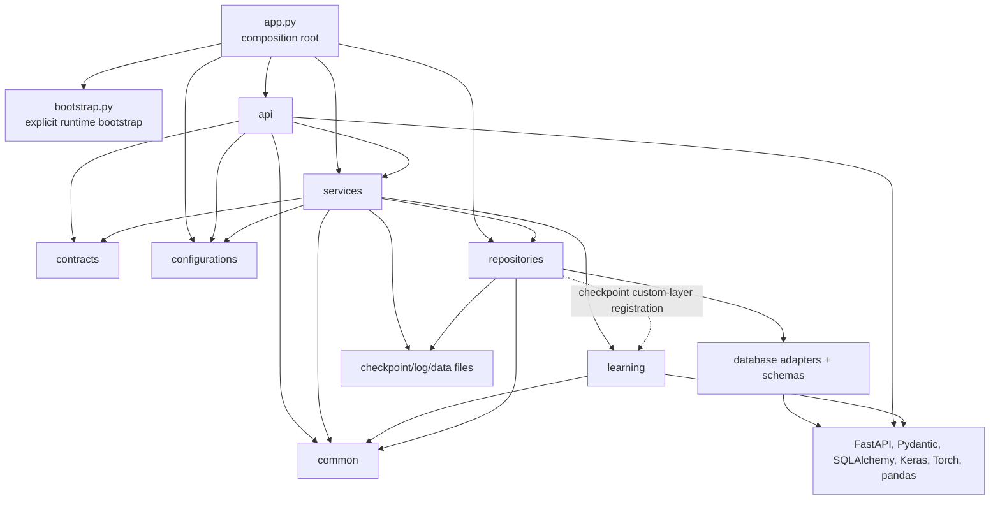
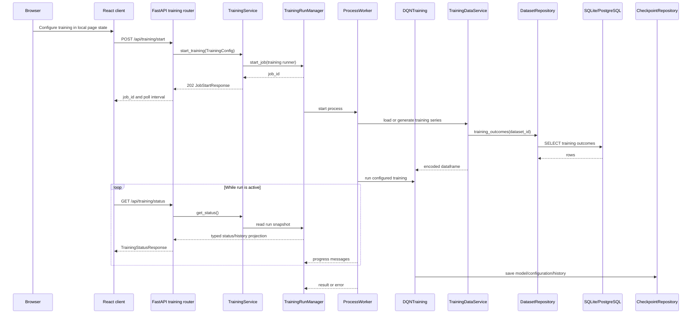
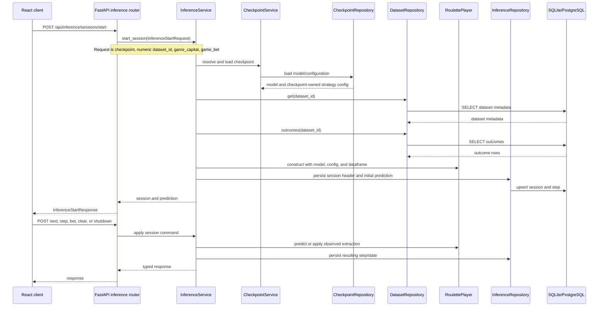
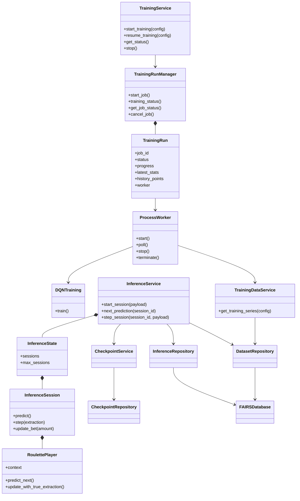

## Execution And Data Flow

Last updated: 2026-08-30

## Current Layering

FAIRS is a layered local monolith with an explicit composition root. The names below describe ownership, not a claim that every package is framework-independent.

- **Interface:** `app/server/api/*` validates HTTP input, calls an application service, validates the response, and translates selected exceptions to HTTP status codes.
- **Contracts:** `app/server/contracts/*` contains Pydantic request/response contracts and validated settings models shared between the interface and application code.
- **Application services:** `app/server/services/*` coordinates dataset import, checkpoint lifecycle, training runs, inference sessions, startup checks, and worker-process orchestration.
- **Learning execution:** `app/server/learning/*` contains roulette betting rules, neural models, training algorithms, and inference players. It receives prepared data and explicit runtime inputs from application services.
- **Persistence adapters:** `app/server/repositories/*` owns SQLAlchemy schema, engines, transactions, dataset/inference repositories, and checkpoint filesystem/configuration I/O.
- **Configuration:** `app/server/bootstrap.py` explicitly loads `.env`, resolves mutable paths, and configures logging before the composition root imports Keras-backed modules; `app/server/configurations/*` resolves JSON settings and typed environment database settings.
- **Shared primitives:** `app/server/common/*` contains paths, constants, logging, normalization, error mapping, version lookup, and the shared roulette feature transformation.

## Current Module Dependency Diagram

The dashed repository-to-learning edge is limited to custom Keras-layer registration required when loading checkpoints. Learning execution does not construct databases or import application repositories.

## Startup Flow

`app/server/app.py` constructs the FastAPI object and routes before lifespan startup. The lifespan then:

1. Resolves typed server settings from JSON and the explicit environment database fields.
2. Runs startup validations and creates the canonical data-root, `logs`, and `checkpoints` directories.
3. Runs the shared Alembic create/upgrade runner for SQLite or PostgreSQL. Empty databases upgrade to `head`; non-empty unversioned databases, drift, unknown/ahead revisions, and multiple heads are rejected without runtime adoption or stamping.
4. Constructs `FAIRSDatabase`, the `DatasetRepository`, and the `InferenceRepository`. The application engine is disposed during lifespan cleanup.
5. Constructs one `CheckpointService`, one `TrainingRunManager`, `DatasetService`, `TrainingService`, and `InferenceService` with those concrete collaborators.
6. Stores the runtime objects on `application.state` for FastAPI dependency providers.

The `server` package itself is import-safe. `server.app` calls `bootstrap_runtime()` before importing Keras-backed application modules; the bootstrap loads/creates `.env`, resolves `FAIRS_DATA_DIR`, and configures logging under the active data root. Direct imports of common path/logger modules do not create files or configure the global logging tree.

## Training Flow

`TrainingRunManager` is the single in-process training-run state owner. It owns the authoritative `TrainingRun`, worker handle, progress, cancellation flag, latest statistics, and history projection. A run may use a child `ProcessWorker`, while the browser polls the status endpoint; there is no WebSocket or durable job table. `additional_episodes` is a resume operation input and is not added to the persisted checkpoint configuration.

## Inference Flow

The inference start contract does not accept dataset-source labels, session replacement identifiers, or strategy overrides. The checkpoint owns strategy behavior; the service only overlays the per-session capital and bet. Active sessions are held in `InferenceState` with a bounded in-memory session count. Database rows provide history, not a rehydration mechanism for the live `RoulettePlayer` object.

## Important Class Relationships

## Responsibility And Duplication Notes

- Validation at the API boundary, service boundary, and database constraint boundary is intentional defense in depth; it is not automatically accidental duplication.
- Roulette feature derivation is one shared transformation in `server.common.roulette`.
- `DatasetRepository` is the sole SQL authority for dataset metadata and outcome rows. `TrainingDataService` owns encoding and sampling after repository reads.
- `CheckpointRepository` owns checkpoint filesystem I/O and validates the current checkpoint configuration contract. `CheckpointService` owns lifecycle policy, including dataset-reference checks before deletion.
- `TrainingRunManager` owns the one authoritative in-process training-run model; `TrainingService` coordinates operations and worker execution around it.
- Training and inference pages own their workflow snapshots. `useTrainingStatus` is the single frontend training-status polling hook; API parsers reject malformed or legacy shapes instead of silently selecting compatibility defaults.

## Concurrency And Observability

- Most handlers are synchronous `def` handlers; file upload is asynchronous for file reads.
- Training runs outside the request thread in a worker process monitored by the `TrainingRunManager` thread.
- Inference is synchronous and stateful per active backend process.
- Logs are timestamped `FAIRS_*.log` files under the configured data-root `logs` directory.
- `GET /api/health` is a lightweight readiness check exposing application version from installed `fairs-server` package metadata; it has no desktop/runtime-mode field.

## Related Files

- Read `backend_api.md` for the endpoint inventory and transport contract.
- Read `persistence.md` for relational tables and filesystem storage.
- Read `findings_and_remediation.md` for evidence, priorities, and migration steps.
