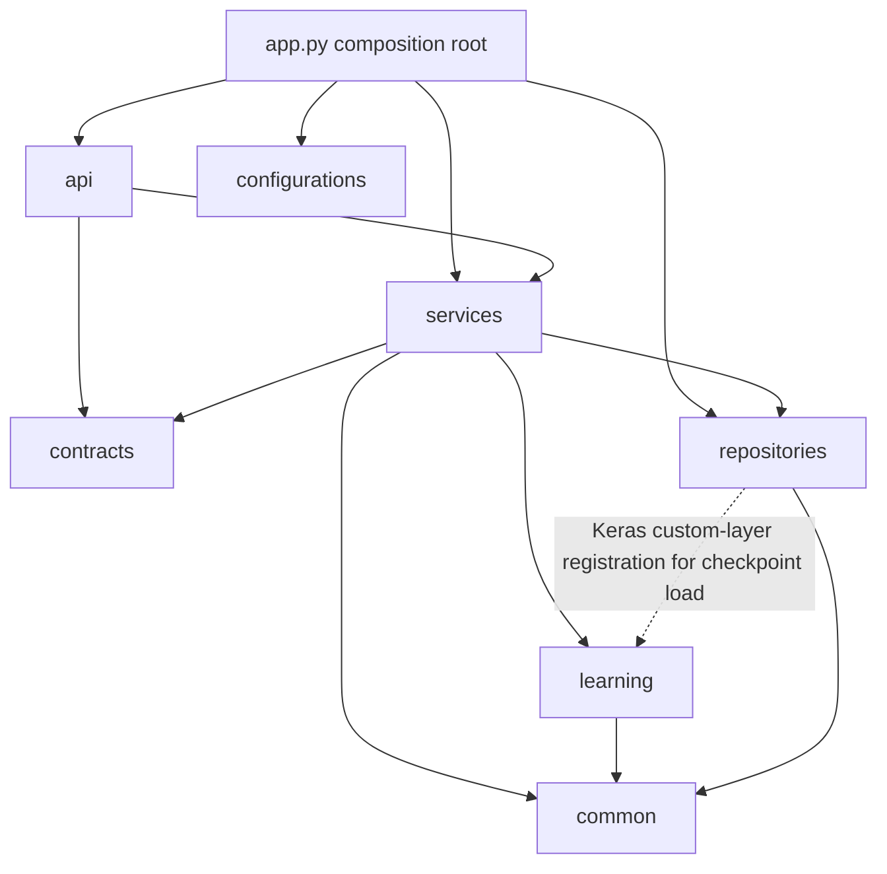
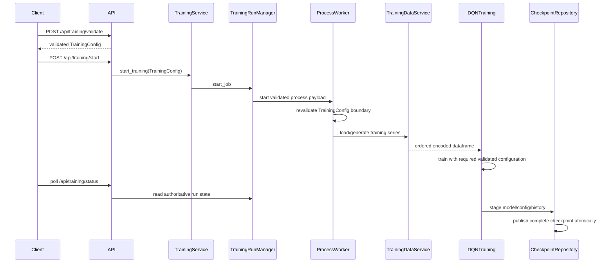
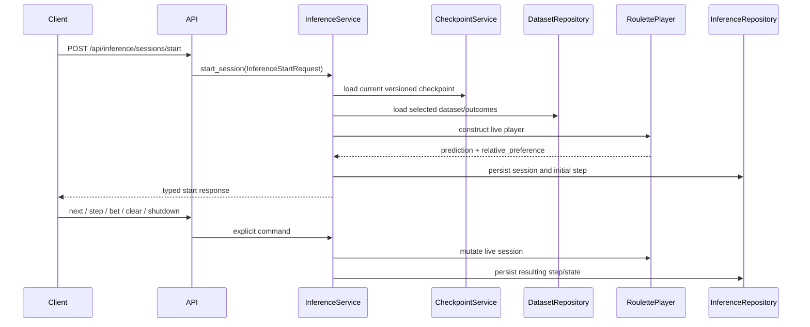

## Execution And Data Flow

Last updated: 2026-09-10

## Current Layering

FAIRS is a layered local monolith with an explicit composition root.

- **Interface:** `app/server/api/*` validates HTTP input/output and translates application exceptions.
- **Contracts:** `app/server/contracts/*` contains Pydantic request/response contracts and validated settings. `TrainingConfig` is the canonical source for training defaults and cross-field semantic rules.
- **Application services:** `app/server/services/*` coordinates datasets, checkpoints, training jobs, inference sessions, startup, and worker processes.
- **Learning execution:** `app/server/learning/*` contains roulette behavior, neural models, training algorithms, and inference players. Required configuration is read directly after validation; learning does not invent fallback defaults for absent required fields.
- **Persistence adapters:** `app/server/repositories/*` owns SQLAlchemy persistence and checkpoint filesystem I/O.
- **Configuration:** `app/server/configurations/*` resolves application-wide settings and environment-backed database/runtime values.
- **Shared primitives:** `app/server/common/*` contains paths, constants, logging, errors, version lookup, identifiers, and roulette feature encoding.

## Dependency Direction

The repository-to-learning edge is limited to Keras deserialization registration. Learning execution does not construct databases or repositories.

## Startup Flow

FastAPI construction is import-safe. Lifespan startup performs the mutable runtime work:

1. Run `bootstrap_runtime()` and load typed settings.
2. Enforce the single-process runtime invariant and validate/create current data directories.
3. Run the shared Alembic initializer. Empty databases upgrade to `head`; known older revisions upgrade in order; unversioned non-empty, unknown, ahead, multi-head, or drifted schemas fail unchanged.
4. Construct the application database and resource repositories.
5. Construct one `CheckpointService`, one `TrainingRunManager`, `DatasetService`, `TrainingService`, and `InferenceService` with explicit collaborators.
6. Publish runtime objects on application state only after initialization succeeds.

Shutdown releases owned resources in reverse order and isolates cleanup failures.

## Training Flow

`TrainingRunManager` is the authoritative in-process job state owner. Training work executes in a child process, but there is no second job model or durable job table.

The training worker revalidates the serialized `TrainingConfig` once at the process boundary. Downstream learning code consumes that complete validated configuration directly instead of using repeated `.get(..., default)` fallback paths.

Global JIT/compiler configuration is injected from `ServerSettings.device`. Per-training GPU selection and mixed precision remain in `TrainingConfig`. JIT fields are not accepted as ignored per-training request settings.

Checkpoint configuration is saved through the explicit versioned `CheckpointConfiguration` contract. Runtime checkpoint loading accepts only the current supported version.

## Inference Flow

`InferenceState` is the authoritative live-session owner. Database rows preserve history but do not reconstruct a live `RoulettePlayer` after restart.

The optional `X-Preserve-Inference-Session` header is retained as the current transactional replay/replacement boundary. It is not an obsolete compatibility alias.

Predictions use `relative_preference`, derived from softmax normalization of Q scores. The old `confidence` name is removed end to end because the value is not a calibrated success probability.

Strategy selection is strict. Fixed strategy mode remains supported, but invalid/missing strategy identifiers do not silently become Keep. Strategy-model output must match the canonical five strategies, Q-model output must match the canonical roulette action count, and invalid actions fail instead of returning neutral rewards.

## Frontend Contract Flow

FastAPI/Pydantic is the only transport schema authority. `app/scripts/generate_frontend_contracts.py` renders `app/client/src/generated/api.ts` from the live backend schema and exports defaults from the Pydantic request models.

Frontend feature code may map snake_case transport data into camelCase view state, but it does not maintain independent response schemas or duplicate semantic training validation. CI fails when the generated transport artifact differs from the backend contract.

## Persistence Flow

- `DatasetRepository` owns dataset/outcome SQL.
- `InferenceRepository` owns inference session/step SQL.
- `CheckpointRepository` owns model/config/history filesystem I/O.
- `CheckpointService` owns cross-storage checkpoint lifecycle policy.
- Alembic owns relational schema evolution.
- `migrate_checkpoints.py` is the explicit one-time conversion path for the known old checkpoint configuration shape. Runtime loading does not perform compatibility conversion.

## Related Files

- `backend_api.md` for endpoints and transport contracts.
- `persistence.md` for relational/checkpoint formats.
- `findings_and_remediation.md` for the completed consolidation audit.
