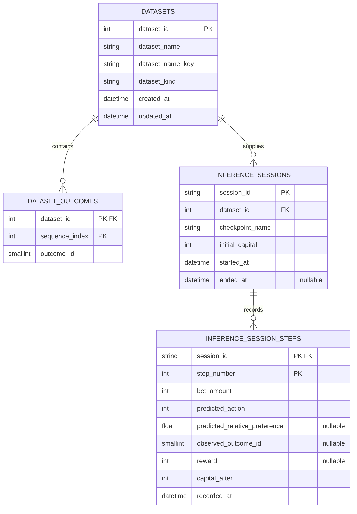

## Persistence

Last updated: 2026-09-10

## Canonical Persistence Model

The relational schema is defined by SQLAlchemy models in `app/server/repositories/schemas/models.py`. Alembic is the only schema-evolution mechanism. Runtime initialization never calls `Base.metadata.create_all()` and never stamps or repairs an unknown schema.

The current migration chain is:

1. `0001_initial_schema`, immutable baseline.
2. `0002_rename_relative_preference`, renames the inference preference column and its check constraint without changing stored numeric values.



## Tables and Relationships

### `datasets`

- `dataset_id` is the integer primary key.
- `dataset_kind` is constrained to `training` or `inference`.
- `(dataset_kind, dataset_name_key)` is unique.
- Dataset outcomes and inference sessions are owned by the dataset and cascade on deletion where permitted by application policy.

### `dataset_outcomes`

- `(dataset_id, sequence_index)` is the composite primary key.
- `outcome_id` is constrained to the single-zero roulette range `0..36`.

### `inference_sessions`

- `session_id` is the normalized string primary key.
- `dataset_id` references `datasets.dataset_id`.
- `checkpoint_name` identifies a filesystem checkpoint, not a relational checkpoint row.
- `ended_at` is nullable while a persisted session is active.

### `inference_session_steps`

- `(session_id, step_number)` is the composite primary key.
- `predicted_action` is constrained to `0..46`, matching the canonical action space.
- `predicted_relative_preference` is nullable and, when present, is constrained to `0..1` by `ck_inference_steps_relative_preference`.
- `observed_outcome_id` is nullable and constrained to `0..36` when present.
- `reward` is nullable until an outcome is supplied.
- The old `predicted_confidence` column and `ck_inference_steps_confidence` constraint are migrated by Alembic revision `0002_rename_relative_preference`; runtime code does not carry aliases for them.

## Storage Surfaces

- Embedded relational data: `app/resources/database.db` by default, or `<FAIRS_DATA_DIR>/database.db` when a custom data root is configured.
- External relational data: PostgreSQL through the same repository/schema model when explicitly selected in `settings/.env`.
- Checkpoints: `<data-root>/checkpoints/<checkpoint_id>/`.
- Logs: `<data-root>/logs/*.log`.

SQLite and PostgreSQL are both current supported persistence modes. They are not parallel application architectures: the same SQLAlchemy schema, repositories, Alembic chain, and service contracts are used for both.

## Database Initialization Rules

`server.repositories.database.initializer.initialize_database()` is the single create/upgrade runner used by FastAPI lifespan, the CLI, and the Windows launcher.

- Empty databases upgrade to Alembic `head`.
- Known revisions behind `head` upgrade in order.
- A database already at `head` receives strict metadata validation and otherwise remains unchanged.
- Non-empty unversioned databases are rejected unchanged.
- Unknown or ahead revisions, multiple heads, and structural drift fail before services start.
- There is no runtime adoption, compatibility stamping, destructive reset, or automatic schema repair.
- SQLite serializes migrations with `BEGIN IMMEDIATE`.
- PostgreSQL uses advisory locks for database creation and target migrations.

## Versioned Checkpoint Contract

Checkpoint JSON is also explicit and versioned. `CheckpointConfiguration` in `app/server/contracts/training.py` is the persisted contract and currently requires:

```text
format_version = 1
training = complete TrainingConfig payload
```

`CheckpointRepository` saves this versioned shape and rejects unversioned, incomplete, or unsupported checkpoint configuration at runtime. It does not inject current defaults into old checkpoint files.

A one-time migration utility exists for the known former unversioned shape:

```powershell
$env:PYTHONPATH='app'
uv --project app/server run python app/scripts/migrate_checkpoints.py
uv --project app/server run python app/scripts/migrate_checkpoints.py --apply
```

The first command is a read-only preflight. It scans every checkpoint configuration, validates the complete migration set, and reports which files require conversion. `--apply` performs atomic writes only after the preflight has succeeded for the full set. Unsupported or ambiguous checkpoint data aborts instead of being silently normalized.

## Checkpoint and Dataset Ownership

- `CheckpointRepository` owns checkpoint filesystem I/O and persisted checkpoint validation.
- `CheckpointService` owns checkpoint lifecycle policy.
- `DatasetRepository` owns dataset SQL persistence.
- `InferenceRepository` owns inference session and step persistence.
- Dataset deletion scans checkpoint metadata first. A referenced dataset or unreadable checkpoint configuration blocks deletion rather than creating a broken cross-storage reference.
- Active inference model objects remain process-local and are not reconstructed from persisted session history after restart.

## Development Migration Workflow

From `app/server`, create and review a new Alembic revision rather than editing an existing migration:

```powershell
uv run alembic -c alembic.ini revision --autogenerate -m "describe schema change"
uv run alembic -c alembic.ini check
uv run alembic -c alembic.ini current --check-heads
uv run alembic -c alembic.ini upgrade head
```

New database schema changes must be represented by a new migration. The initial migration remains immutable.

## Related Files

- Read `execution_and_data_flow.md` for persistence call chains.
- Read `../runtime/configuration.md` for database selection.
- Read `../runtime/startup.md` for startup and migration behavior.
