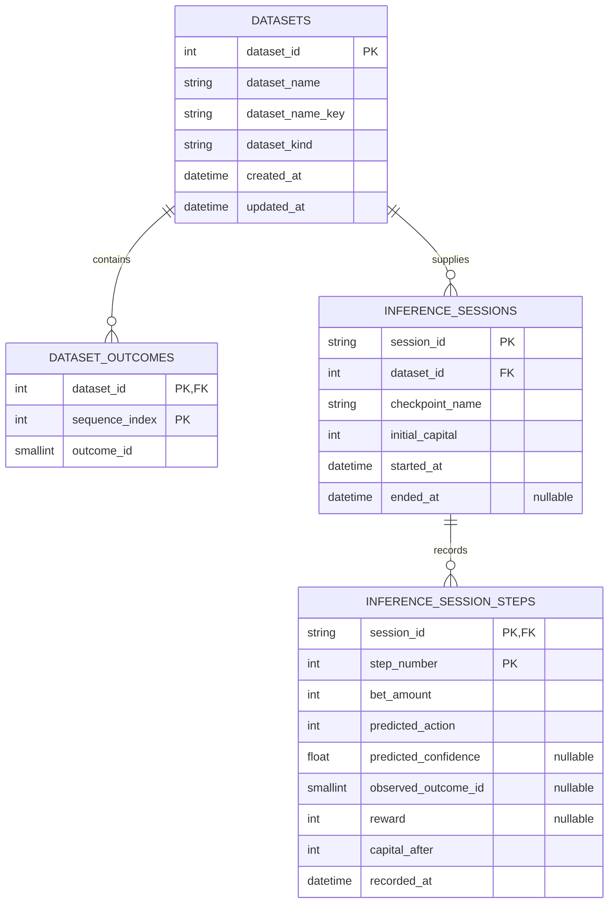

## Persistence

Last updated: 2026-08-30

## Current Persistence Model

The relational schema is defined by SQLAlchemy models in `app/server/repositories/schemas/models.py`, and Alembic is the authoritative schema-evolution mechanism. The immutable baseline is `app/server/alembic/versions/0001_initial_schema.py`; runtime initialization never calls `Base.metadata.create_all()` and never uses a native SQLite schema marker.



## Tables and Relationships

### `datasets`

- Integer auto-increment primary key `dataset_id`.
- `dataset_kind` is constrained to `training` or `inference` by `ck_datasets_kind`.
- `dataset_name_key` stores the case-folded name used for replacement/import uniqueness.
- The pair `(dataset_kind, dataset_name_key)` is unique through `uq_datasets_kind_name_key`.
- `ix_datasets_kind_name` supports kind/name ordering and lookup.
- A dataset owns its outcome rows and inference sessions.

### `dataset_outcomes`

- Composite primary key `(dataset_id, sequence_index)` makes each sequence position unique within a dataset.
- `dataset_id` references `datasets.dataset_id` with `ON DELETE CASCADE`.
- `sequence_index >= 0` through `ck_dataset_outcomes_sequence`.
- `outcome_id` is restricted to the single-zero roulette range `0..36` through `ck_dataset_outcomes_outcome`.
- `ix_dataset_outcomes_dataset_outcome` supports dataset/outcome lookups.

### `inference_sessions`

- String `session_id` is the primary key and is normalized before persistence.
- `dataset_id` references `datasets.dataset_id` with `ON DELETE CASCADE`.
- `checkpoint_name` is a bounded filesystem checkpoint identifier, not a foreign key to a relational table.
- `initial_capital > 0` through `ck_inference_sessions_initial_capital`.
- `ended_at` is nullable for active sessions.
- `ix_inference_sessions_dataset_started` supports dataset history ordered by start time.

### `inference_session_steps`

- Composite primary key `(session_id, step_number)` makes each step unique within a session.
- `session_id` references `inference_sessions.session_id` with `ON DELETE CASCADE`.
- `step_number > 0` through `ck_inference_steps_step_number`, and `bet_amount > 0` through `ck_inference_steps_bet_amount`.
- `predicted_action` is bounded to `0..46` through `ck_inference_steps_action`, matching the model action space.
- `observed_outcome_id` is nullable and, when present, is bounded to `0..36` through `ck_inference_steps_observed_outcome`.
- `predicted_confidence` is nullable and, when present, is bounded to `0..1` through `ck_inference_steps_confidence`.
- `capital_after`, `recorded_at` are required.
- `ix_inference_steps_session_recorded` supports session history retrieval.

## Storage Surfaces

- **Embedded relational data:** `app/resources/database.db` by default, or `<FAIRS_DATA_DIR>/database.db` when a custom data root is configured.
- **External relational data:** PostgreSQL selected through `settings/.env`, validated at startup with a connection probe and required table/column check.
- **Checkpoints:** `<data-root>/checkpoints/<checkpoint_id>/` containing model files and JSON configuration/history.
- **Logs:** `<data-root>/logs/*.log`.

The checkpoint configuration stores values such as `dataset_id`, but the database cannot enforce a relationship to a checkpoint directory. Dataset deletion therefore scans checkpoint metadata and returns a conflict when a readable checkpoint references the dataset; unreadable metadata also blocks deletion. Immutable dataset snapshots remain deferred.

## Initialization and Migration Rules

- `server.repositories.database.initializer.initialize_database()` is the single shared create/upgrade runner used by FastAPI lifespan, the CLI, and launcher actions.
- SQLite creates the parent directory as needed, uses Python 3.14 transaction control with `autocommit=False`, preserves foreign-key/WAL/busy-timeout pragmas, and serializes the migration transaction with `BEGIN IMMEDIATE`.
- PostgreSQL first connects to the configured target. Only SQLSTATE `3D000` triggers an AUTOCOMMIT connection to `postgres`; database creation is rechecked under a deterministic advisory lock and requires the configured role to have `CREATEDB`. Target migrations use a transaction-level advisory lock and a bounded lock timeout.
- An empty database upgrades to `head`.
- Any non-empty database without an Alembic revision is rejected unchanged. Partial, unknown, or drifted unversioned schemas fail before services start; there is no runtime adoption or stamping path.
- Unknown/ahead revisions, multiple database heads, multiple script heads, and post-upgrade drift fail before services start. Automatic repair is intentionally disabled.
- A known revision behind `head` upgrades in order. A database already at `head` performs strict drift validation and then a no-op.
- Application startup runs this state machine before constructing repositories/services. The explicit launcher/CLI path is idempotent and means create/upgrade.
- There is no seed/catalog workflow.

## Development Migration Workflow

From `app/server`, generate a candidate revision, review it manually, and apply it only after checking the SQL and both upgrade/downgrade paths:

```powershell
uv run alembic -c alembic.ini revision --autogenerate -m "describe schema change"
uv run alembic -c alembic.ini check
uv run alembic -c alembic.ini current --check-heads
uv run alembic -c alembic.ini upgrade head
```

Use `uv run alembic -c alembic.ini upgrade head --sql` for offline SQL generation. `alembic.ini` contains no credentials; commands resolve the configured database from the normal environment settings or receive a URL through the command configuration. Future constraints must have explicit names. Do not rename the existing unnamed foreign-key constraints for dialect-specific consistency.

## Persistence Boundaries

- API modules do not embed direct database logic.
- Dataset operations flow through `DatasetRepository`, the sole SQL dataset authority. Inference session and step operations flow through `InferenceRepository`.
- `TrainingDataService` owns stored/synthetic training-series selection, calls `DatasetRepository.training_outcomes()`, and applies the shared roulette encoding before learning runs.
- `CheckpointRepository` owns checkpoint filesystem I/O and current configuration validation; `CheckpointService` owns checkpoint lifecycle policy outside the relational schema.
- Schema, serializer, and API contract changes should be reviewed together.

## Architectural Assessment

The relational ownership and cascade rules are coherent for datasets, outcomes, sessions, and steps. Current startup checks make stale/newer schema state observable, and checkpoint-aware dataset deletion prevents the known cross-storage reference hazard. Migration history, immutable dataset snapshots, and a relational checkpoint reference remain deferred; no schema or persisted checkpoint format change is included in this review.

## Related Files

- Read `execution_and_data_flow.md` for repository and serializer call chains.
- Read `../runtime/configuration.md` for database settings.
- Read `../runtime/startup.md` for initialization commands and lifecycle behavior.
- Read `findings_and_remediation.md` for schema-versioning and checkpoint lifecycle risks.
