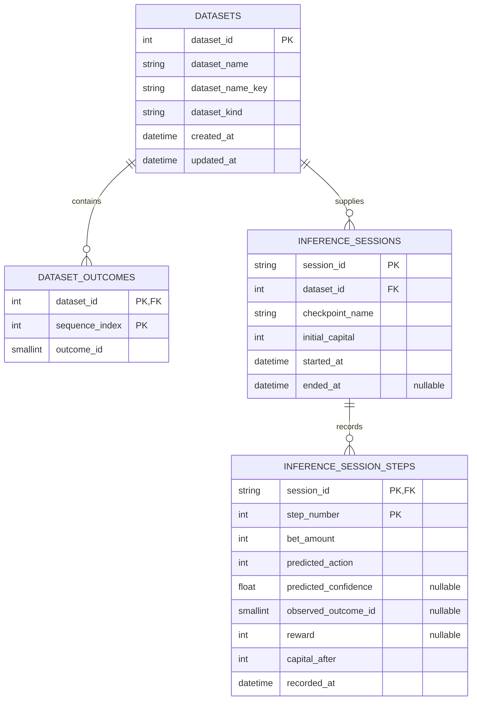

## Persistence

Last updated: 2026-08-20

## Current Persistence Model

The relational schema is defined directly by SQLAlchemy models in `app/server/repositories/schemas/models.py`. The repository contains no Alembic or other migration history. `Base.metadata.create_all()` creates a missing schema during explicit initialization; normal startup performs a non-destructive structural compatibility check but does not migrate an existing database. SQLite schema creation records version `1` with `PRAGMA user_version`; a newer unsupported version fails fast.

## Tables and Relationships

### `datasets`

- Integer auto-increment primary key `dataset_id`.
- `dataset_kind` is constrained to `training` or `inference` by `ck_datasets_kind`.
- `dataset_name_key` stores the case-folded name used for replacement/import uniqueness.
- The pair `(dataset_kind, dataset_name_key)` is unique through `uq_datasets_kind_name_key`.
- `ix_datasets_kind_name` supports kind/name ordering and lookup.
- A dataset owns its outcome rows and inference sessions.

### `dataset_outcomes`

- Composite primary key `(dataset_id, sequence_index)` makes each sequence position unique within a dataset.
- `dataset_id` references `datasets.dataset_id` with `ON DELETE CASCADE`.
- `sequence_index >= 0` through `ck_dataset_outcomes_sequence`.
- `outcome_id` is restricted to the single-zero roulette range `0..36` through `ck_dataset_outcomes_outcome`.
- `ix_dataset_outcomes_dataset_outcome` supports dataset/outcome lookups.

### `inference_sessions`

- String `session_id` is the primary key and is normalized before persistence.
- `dataset_id` references `datasets.dataset_id` with `ON DELETE CASCADE`.
- `checkpoint_name` is a bounded filesystem checkpoint identifier, not a foreign key to a relational table.
- `initial_capital > 0` through `ck_inference_sessions_initial_capital`.
- `ended_at` is nullable for active sessions.
- `ix_inference_sessions_dataset_started` supports dataset history ordered by start time.

### `inference_session_steps`

- Composite primary key `(session_id, step_number)` makes each step unique within a session.
- `session_id` references `inference_sessions.session_id` with `ON DELETE CASCADE`.
- `step_number > 0` through `ck_inference_steps_step_number`, and `bet_amount > 0` through `ck_inference_steps_bet_amount`.
- `predicted_action` is bounded to `0..46` through `ck_inference_steps_action`, matching the model action space.
- `observed_outcome_id` is nullable and, when present, is bounded to `0..36` through `ck_inference_steps_observed_outcome`.
- `predicted_confidence` is nullable and, when present, is bounded to `0..1` through `ck_inference_steps_confidence`.
- `capital_after`, `recorded_at` are required.
- `ix_inference_steps_session_recorded` supports session history retrieval.

## Storage Surfaces

- **Embedded relational data:** `app/resources/database.db` by default, or `<FAIRS_DATA_DIR>/database.db` when a custom data root is configured.
- **External relational data:** PostgreSQL selected through `settings/.env`, validated at startup with a connection probe and required table/column check.
- **Checkpoints:** `<data-root>/checkpoints/<checkpoint_id>/` containing model files and JSON configuration/history.
- **Logs:** `<data-root>/logs/*.log`.

The checkpoint configuration stores values such as `dataset_id`, but the database cannot enforce a relationship to a checkpoint directory. Dataset deletion therefore scans checkpoint metadata and returns a conflict when a readable checkpoint references the dataset; unreadable metadata also blocks deletion. Immutable dataset snapshots remain deferred.

## Initialization Rules

- SQLite startup creates the schema only when the configured database file is missing. An existing file is not reset, reseeded, or migrated; it is structurally validated during normal startup.
- PostgreSQL startup does not create the database or schema. It executes a non-mutating connection probe followed by structural validation.
- The explicit launcher/database initializer creates or ensures the configured schema.
- The current marker is a compatibility check, not a migration runner; future incompatible changes still require an explicit migration workflow.
- There is no seed/catalog workflow.

## Persistence Boundaries

- API modules do not embed direct database logic.
- Dataset and inference operations flow through `DatasetRepository` and `InferenceRepository`, coordinated for services by `DataStore`.
- Training reads use `TrainingRepositoryQueries` and `TrainingSeriesLoader`, constructed by the application-owned `TrainingDataService` inside the worker process.
- Model/checkpoint files use `CheckpointStorage` and `CheckpointService`, outside the relational schema.
- Schema, serializer, and API contract changes should be reviewed together.

## Architectural Assessment

The relational ownership and cascade rules are coherent for datasets, outcomes, sessions, and steps. Current startup checks make stale/newer schema state observable, and checkpoint-aware dataset deletion prevents the known cross-storage reference hazard. Migration history, immutable dataset snapshots, and a relational checkpoint reference remain deferred; no schema or persisted checkpoint format change is included in this review.

## Related Files

- Read `execution_and_data_flow.md` for repository and serializer call chains.
- Read `../runtime/configuration.md` for database settings.
- Read `../runtime/startup.md` for initialization commands and lifecycle behavior.
- Read `findings_and_remediation.md` for schema-versioning and checkpoint lifecycle risks.
