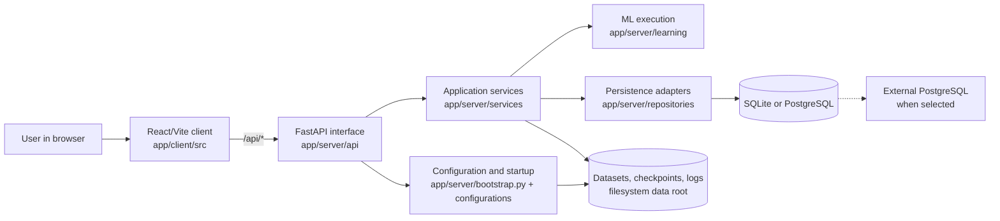

## System Overview

Last updated: 2026-09-01

## Current State

FAIRS is a Windows-first local web application for roulette training and inference experiments. The repository contains a React/Vite client and a FastAPI server; the server is the system of record for API behavior, training orchestration, inference session state, persistence, and startup readiness.

The application is intentionally a single local deployment. Training is isolated in a worker process, while jobs and active inference sessions remain in memory. SQLite is the embedded default; PostgreSQL is supported as an explicitly configured external backend. Checkpoints and logs are filesystem data rather than database entities. The FastAPI lifespan owns startup/shutdown; one Uvicorn worker is required. Closing the browser does not stop the backend or an active inference session, but backend restart expires live model state.



The diagram reflects the current implementation. Application services own process orchestration and pass explicit data/configuration into learning execution; learning modules do not import persistence adapters. Checkpoint deserialization remains a repository-owned custom-layer concern documented in `execution_and_data_flow.md`.

## Source Tree

The structure below is source-focused and excludes dependency, cache, and generated folders.

```text
.
├─ app/
│  ├─ client/
│  │  ├─ package.json
│  │  ├─ vite.config.ts
│  │  └─ src/
│  │     ├─ App.tsx
│  │     ├─ main.tsx
│  │     ├─ components/
│  │     ├─ hooks/
│  │     ├─ pages/
│  │     ├─ styles/
│  │     ├─ types/
│  │     └─ utils/
│  ├─ resources/
│  │  ├─ checkpoints/
│  │  ├─ logs/
│  │  └─ database.db
│  ├─ scripts/
│  │  ├─ export_openapi.py
│  │  └─ initialize_database.py
│  ├─ server/
│  │  ├─ app.py
│  │  ├─ bootstrap.py
│  │  ├─ pyproject.toml
│  │  ├─ api/
│  │  ├─ common/
│  │  ├─ configurations/
│  │  ├─ contracts/
│  │  ├─ learning/
│  │  ├─ repositories/
│  │  └─ services/
│  ├─ shared/
│  │  └─ openapi.json
│  └─ tests/
│     ├─ conftest.py
│     ├─ e2e/
│     └─ unit/
├─ assets/
│  ├─ docs/
│  └─ figures/
├─ runtimes/
├─ settings/
│  └─ configurations.json
└─ start_on_windows.ps1
```

## Backend Ownership

- `app/server/app.py` constructs the import-safe FastAPI transport surface. Its lifespan invokes `app/server/bootstrap.py`, then validates configuration/schema state, constructs application-owned resources, and wires runtime services; cleanup is reverse-ordered and failure-isolated.
- `app/server/api` contains transport handlers, request validation, response validation, and HTTP exception translation. It does not access SQLAlchemy directly.
- `app/server/contracts` contains Pydantic request/response contracts and validated runtime settings. These are boundary contracts, not persistent entities or a separate domain model.
- `app/server/services` owns application orchestration: dataset import, checkpoint lifecycle, training jobs, inference sessions, startup checks, in-process job state, and the training worker process orchestration.
- `app/server/learning` owns roulette betting logic, neural models, environments, training algorithms, and inference players. Learning receives prepared data and explicit runtime inputs rather than constructing persistence adapters.
- `app/server/repositories` owns SQLAlchemy schema definitions, database engines/transactions, dataset and inference persistence, and checkpoint filesystem/configuration I/O.
- `app/server/common` contains narrowly scoped cross-cutting primitives such as paths, constants, error mapping, logging, session/checkpoint normalization, and roulette feature encoding.
- `app/server/configurations` resolves environment and JSON settings and exposes the runtime configuration used by composition and selected ML components.

## Frontend Ownership

- `src/App.tsx` composes `BrowserRouter`, the guidance provider, and the two application routes.
- `src/pages` owns route-level composition for Training and Inference.
- `src/components` owns reusable layout, guidance, upload, wizard, dashboard, and session views.
- `src/hooks` own feature-local request/status orchestration; Training and Inference pages own their workflow snapshots.
- `src/types` defines frontend state and response shapes; `src/utils` contains defensive API parsing and upload helpers.
- Styling is token-driven through `src/styles/global.css`, feature stylesheets, and CSS modules.

## Entry Points

- Backend app: `app/server/app.py`
- Frontend entry: `app/client/src/main.tsx`
- Frontend routes: `app/client/src/App.tsx`
- Windows launcher: `start_on_windows.ps1` (one-worker startup, ownership-aware explicit stop)

## Runtime Boundary

The repository provides local web mode. It does not contain a desktop installer, packaged executable path, container deployment, WebSocket API, or distributed job/session store.

## Related Files

- Read `backend_api.md` for the mounted HTTP surface.
- Read `execution_and_data_flow.md` for current and target dependency direction and critical flows.
- Read `persistence.md` for relational and filesystem storage.
- Read `findings_and_remediation.md` for evidence-backed architectural findings and priorities.
