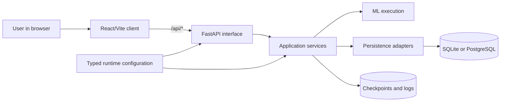

## System Overview

Last updated: 2026-09-10

## Current State

FAIRS is a Windows-first local web application for roulette training and inference experiments. It is intentionally a layered local monolith with one current implementation for each major responsibility.

The repository contains a React/Vite client and a FastAPI backend. Training runs in a child worker process, while active job state and live inference models remain process-local. SQLite is the embedded default and PostgreSQL is an explicitly configured alternative using the same SQLAlchemy repositories and Alembic schema. Checkpoints and logs are filesystem data.



## Canonical Ownership

| Responsibility | Canonical owner |
| --- | --- |
| HTTP request/response schema | `app/server/contracts` plus FastAPI/Pydantic |
| Frontend transport types | generated `app/client/src/generated/api.ts` |
| Training defaults and semantic validation | `TrainingConfig` |
| Per-training GPU/device/mixed precision | `TrainingConfig` |
| Global JIT/compiler behavior | `ServerSettings.device` from `settings/configurations.json` |
| Deployment/database environment | typed `.env` settings |
| Relational schema | SQLAlchemy models plus current Alembic head |
| Database migration | Alembic only |
| Checkpoint persisted configuration | versioned `CheckpointConfiguration` |
| Checkpoint conversion from known old shape | one-time `app/scripts/migrate_checkpoints.py` |
| Dataset SQL persistence | `DatasetRepository` |
| Inference SQL persistence | `InferenceRepository` |
| Checkpoint filesystem I/O | `CheckpointRepository` |
| Active training state | `TrainingRunManager` |
| Active inference state | `InferenceState` |
| Frontend workflow/view state | feature-local React state/hooks |
| Launcher cache ownership | `runtimes/cache` and `app/tests/cache` |
| Application lifecycle | FastAPI lifespan and `bootstrap_runtime()` |
| Application version | backend package metadata |

Generated TypeScript is a derived artifact, not a parallel authority. CI regenerates it conceptually from the live backend contract and fails if the checked-in result is stale.

## Source Tree

```text
.
├─ app/
│  ├─ client/
│  │  └─ src/
│  │     ├─ generated/api.ts
│  │     ├─ components/
│  │     ├─ hooks/
│  │     ├─ pages/
│  │     ├─ styles/
│  │     ├─ types/
│  │     └─ utils/
│  ├─ resources/
│  │  ├─ checkpoints/
│  │  ├─ logs/
│  │  └─ database.db
│  ├─ scripts/
│  │  ├─ export_openapi.py
│  │  ├─ generate_frontend_contracts.py
│  │  ├─ initialize_database.py
│  │  └─ migrate_checkpoints.py
│  ├─ server/
│  │  ├─ app.py
│  │  ├─ bootstrap.py
│  │  ├─ api/
│  │  ├─ common/
│  │  ├─ configurations/
│  │  ├─ contracts/
│  │  ├─ learning/
│  │  ├─ repositories/
│  │  └─ services/
│  └─ tests/
├─ assets/docs/
├─ runtimes/
├─ settings/
│  ├─ .env.example
│  └─ configurations.json
└─ start_on_windows.ps1
```

`app/shared/openapi.json` is intentionally absent. Runtime OpenAPI is derived directly from FastAPI and can be exported to an explicitly selected location when needed.

## Backend Boundaries

- `app/server/app.py` is the composition root and lifecycle owner.
- `app/server/api` handles HTTP translation only.
- `app/server/contracts` contains Pydantic transport and configuration contracts.
- `app/server/services` owns application orchestration and process-local session/job lifecycle.
- `app/server/learning` owns roulette rules, neural models, training, and inference execution.
- `app/server/repositories` owns relational persistence and checkpoint filesystem persistence.
- `app/server/common` contains narrow shared primitives only.
- `app/server/configurations` resolves global technical settings and typed environment configuration.

Learning code receives explicit validated configuration and prepared data. It does not construct persistence adapters or invent fallback defaults for missing required configuration.

## Frontend Boundaries

- `src/generated/api.ts` contains backend-derived transport types and request defaults.
- `src/types` contains browser/view-state models rather than independent HTTP contracts.
- `src/utils/*Api.ts` performs typed transport calls and maps transport fields to UI representations where needed.
- `src/pages`, `src/components`, and `src/hooks` own feature-local workflow and presentation state.
- Browser inference storage is advisory replay/setup metadata only. Backend `InferenceState` remains authoritative for a live session.

## Runtime Boundary

The repository supports one local backend process. It does not implement a distributed job store, distributed inference-session store, or multi-worker coordination. One Uvicorn worker is therefore an explicit runtime invariant.

## Related Files

- `backend_api.md` for HTTP contract ownership.
- `execution_and_data_flow.md` for process and data flows.
- `persistence.md` for relational and checkpoint persistence.
- `findings_and_remediation.md` for the completed single-source-of-truth audit.
